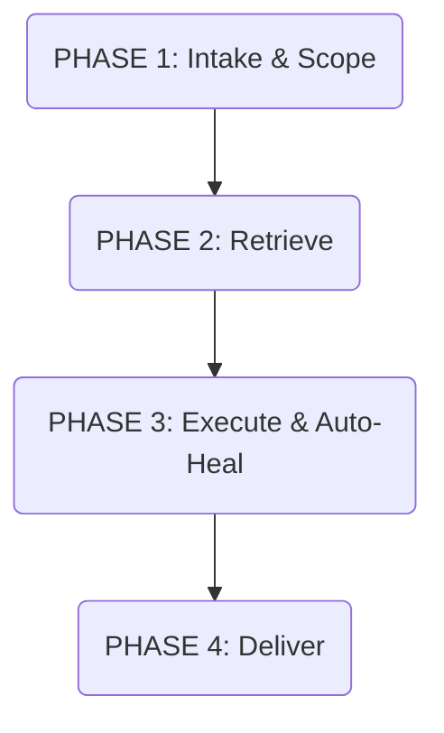

# Global Developer Suite (custom-dev-suite)

This global skill establishes behavioral guidelines, programming safety disciplines, premium visual aesthetics, animation constraints, and structured context practices for all coding tasks performed on this machine.

Your SEOSONA system root is accessible at `~/.seosona`. All file references below are relative paths from that root.

---

## 1. ESSENCE GUIDES

When executing specialized tasks, the agent MUST consult and comply with the detailed instructions in the following modular guides:

### 1.1 Cognitive & Security Rules (1_CORE/rules/)
*   🛡️ **Security Regex Rules** (`1_CORE/rules/security_regex_rules.md`): Standard credential leak prevention regex checks.
*   📦 **Dependency Audit Rules** (`1_CORE/rules/dependency_audit_rules.md`): Supply chain vulnerability scanning and auto-healing patches.
*   🔑 **Interface Contract Validation** (`1_CORE/rules/interface_contract_validation.md`): Statically verifying required exported functions against contracts.

### 1.2 Context & Memory Layout (2_KNOWLEDGE/sops/)
*   📍 **Mempalace Spatial Memory** (`2_KNOWLEDGE/sops/mempalace_sop.md`): Wings, Rooms, and Drawers structure and `.aaak` compression.
*   🕸️ **LightRAG Graph Mapping** (`2_KNOWLEDGE/sops/lightrag_graph_mapping.md`): Maintaining entity-relationship graphs for large codebases.
*   🧹 **Context Cleaning & Optimization** (`2_KNOWLEDGE/sops/context_cleaning_optimization.md`): Whitespace pruning, compiler log truncation, and token efficiency.
*   📊 **SEOSONA OS Blackboard Protocol** (`2_KNOWLEDGE/sops/seosona_blackboard_protocol.md`): Task state transitions, CEO approval rule, and the 2-Strike failsafe.

### 1.3 Development & Design Standards (2_KNOWLEDGE/frameworks/core_system/custom-dev-suite/)
*   🧠 **Karpathy Coding Standards** (`2_KNOWLEDGE/frameworks/core_system/custom-dev-suite/karpathy_coding_standards.md`): Think before coding, surgical edits, simplicity first, goal-driven execution.
*   🎨 **MagicUI Bento Patterns** (`2_KNOWLEDGE/frameworks/core_system/custom-dev-suite/magicui_bento_patterns.md`): Layout rhythm, bento cell visual assets, dynamic border glows.
*   🃏 **Tailwind Motion Design** (`2_KNOWLEDGE/frameworks/core_system/custom-dev-suite/tailwind_motion_design.md`): Tactile scale transforms, hardware acceleration, transition constraints.
*   📤 **UI/UX Pro Max Typography** (`2_KNOWLEDGE/frameworks/core_system/custom-dev-suite/ui_ux_pro_max_typography.md`): Display headings scales, descender leading adjustments.
*   🎗️ **Anthropic Brand Styling** (`2_KNOWLEDGE/frameworks/core_system/custom-dev-suite/anthropic_brand_styling.md`): B&W muted palettes, Poppins + Lora font pairings, accent rules.
*   📜 **Completeness Output Enforcement** (`2_KNOWLEDGE/frameworks/core_system/custom-dev-suite/completeness_output_enforcement.md`): Outlawing placeholders, token boundary continuation protocols.
*   💻 **OpenAI CLI Creator** (`2_KNOWLEDGE/frameworks/core_system/custom-dev-suite/openai_cli_creator.md`): Composable CLI command models (Noun-Verb), stdout JSON/stderr progress logs, exit codes, auth priority, companion skill.
*   🔌 **OpenAI Apps SDK** (`2_KNOWLEDGE/frameworks/core_system/custom-dev-suite/openai_apps_sdk.md`): Decoupled data/render patterns, tool annotations.
*   🕷️ **Scrapling Crawling DOM** (`2_KNOWLEDGE/frameworks/core_system/custom-dev-suite/scrapling_crawling_dom.md`): High-speed scraping selectors, crawler bypass headers.
*   🧬 **Harness CI Verification** (`2_KNOWLEDGE/frameworks/core_system/custom-dev-suite/harness_ci_verification.md`): CI checks, local compilation and test suite verification.
*   🔍 **Swarms Autoresearch Loop** (`2_KNOWLEDGE/frameworks/core_system/custom-dev-suite/swarms_autoresearch_loop.md`): Self-modifying compiler error recovery loops.
*   🎭 **Personaplex Agent Roles** (`2_KNOWLEDGE/frameworks/core_system/custom-dev-suite/personaplex_agent_roles.md`): Expert sub-personas (Designer, DevOps, Auditor).
*   🌐 **Managed Agents API** (`2_KNOWLEDGE/frameworks/core_system/custom-dev-suite/managed_agents_api.md`): HTTP Managed Agent calls, SSE streams.
*   🌌 **Algorithmic Art p5js** (`2_KNOWLEDGE/frameworks/core_system/custom-dev-suite/algorithmic_art_p5js.md`): Seeded randomness, flow fields, generative manifesto.
*   📐 **Canvas Design PDF** (`2_KNOWLEDGE/frameworks/core_system/custom-dev-suite/canvas_design_pdf.md`): Abstract compositions, clinical markers, margins.
*   ✏️ **Writing Voice & Tone** (`2_KNOWLEDGE/frameworks/core_system/custom-dev-suite/writing_voice_tone.md`): Guidelines for documentation and technical writing.
*   ♿ **Web Interface Compliance** (`2_KNOWLEDGE/frameworks/core_system/custom-dev-suite/web_interface_compliance.md`): WCAG AA contrast, accessibility inputs verification.
*   📝 **Obsidian Markdown Skills** (`2_KNOWLEDGE/frameworks/core_system/custom-dev-suite/obsidian_markdown_skills.md`): Markdown wikis, schema definitions.
*   📱 **Minimax Tool Calling** (`2_KNOWLEDGE/frameworks/core_system/custom-dev-suite/minimax_tool_calling.md`): Multimedia parameters, timeouts handling.
*   ⚡ **Oh My OpenAgent Workflows** (`2_KNOWLEDGE/frameworks/core_system/custom-dev-suite/oh_my_openagent_workflows.md`): OpenAgent pipelines and receipts tracking.
*   🔨 **Get Shit Done Pragmatism** (`2_KNOWLEDGE/frameworks/core_system/custom-dev-suite/get_shit_done_pragmatism.md`): Pragmatic engineering, minimal scaffolding.
*   📒 **Technical Project Scoping** (`2_KNOWLEDGE/frameworks/core_system/custom-dev-suite/technical_project_scoping.md`): Technical specs requirements checklists, release logs.

---

## 2. THE UNIFIED MASTER FLOW

Every development session must follow this four-phase cycle:

1.  **Intake & Scope:** Prune context window, declare visual dials (if applicable), and list task items in `task.md`.
2.  **Retrieve:** Query spatial wings, trace entity connections, and load `.aaak` summaries.
3.  **Execute & Auto-Heal:** Apply surgical edits matching local style, compile/test verification checks, and auto-correct errors up to 2 times (2-Strike Rule).
4.  **Deliver:** Activate target sub-personas, produce raw outputs without conversation fluff, and await CEO approval.
