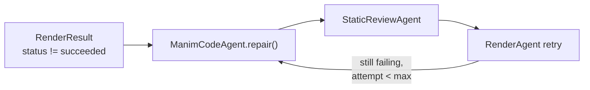

# Architecture Extract: Math-To-Manim

## Directory Structure
```text
Math-To-Manim/
    .gitignore
    AGENTS.md
    disk-space-audit.ps1
    instructions.md
    PhysRevLett.130.041601.pdf
    pyproject.toml
    README.md
    requirements-system.txt
    zzzz.md
    .github/
        workflows/
            ci.yml
    .hermes/
        erdos_unit_distance_prompt.md
        plans/
            ErdosUnitDistanceProblem_prompt.txt
        video-inputs/
            x-2058920683510628577/
                three_d_circle_area_prompt.md
                frames/
    .tmp-hf-about-me/
        README.md
    .tmp-hf-about-me-verify/
        README.md
    docs/
        ARCHITECTURE.md
        ARTIFACT_SCHEMAS.md
        DEPLOYMENT_ROADMAP.md
        DOMAIN_SKILLS.md
        EVAL_STRATEGY.md
        HERMES_LEARNS_MANIM.md
        MIGRATION_NOTES.md
        PRIME_INTELLECT_RL.md
        README.md
        ROADMAP.md
        assets/
            prime-intellect/
                README.md
        showcase/
            README.md
            assets/
    environments/
        math_to_manim/
            pyproject.toml
            README.md
            m2m2_visual_repair/
                environment.py
                scoring.py
                __init__.py
                configs/
                    followup_infer.toml
                    followup_orch.toml
                    followup_train.toml
                    repair_infer.toml
                    repair_orch.toml
                    repair_train.toml
                    smoke_infer.toml
                    smoke_orch.toml
                    smoke_train.toml
                data/
                    repair_tasks.jsonl
                    repair_tasks_sample.jsonl
            math_to_manim/
                __init__.py
    evals/
        prompt_suite.yaml
    examples/
        mathematics/
            analysis/
                influence_sensitivity_tradeoff.py
        mythos/
            qft_cinematic.py
            smoke_test.py
        reference/
            limit_tangent_reference.py
    hermes/
        skills/
            hermes-learns-manim/
                SKILL.md
    legacy/
        Math-To-Manim/
            .gitattributes
            .gitignore
            CLAUDE.md
            CODE_REVIEW.md
            CONTRIBUTING.md
            pyproject.toml
            pytest.ini
            README.md
            requirements.txt
            .claude/
                settings.local.json
                plugins/
                    math-to-manim/
                        plugin.json
                        README.md
                        skills/
                            math-to-manim/
                                SKILL.md
                                examples/
                                    pythagorean-theorem/
                                        input.md
                                        knowledge-tree.json
                                        output.py
                                        verbose-prompt.txt
                                references/
                                    agent-system-prompts.md
                                    manim-code-patterns.md
                                    reverse-knowledge-tree.md
                                    verbose-prompt-format.md
                worktrees/
                    thirsty-rubin-fca258/
            .github/
                copilot-instructions.md
                instructions/
                    agents.instructions.md
                    examples.instructions.md
                    tests.instructions.md
                workflows/
                    ci.yml
            .hermes/
                plans/
                    2026-04-29_101804-readme-rebuild-and-demo-stabilization.md
            docs/
                10_MINUTE_MULTI_AGENT_DEMO.md
                AGENT_ARCHITECTURE.md
                AGENT_FAQ.md
                AGENT_INSPECTION_GUIDE.md
                AGENT_PIPELINE_GUIDE.md
                ARCHITECTURE.md
                Benamou-Brenier-Wasserstein.pdf
                CLAUDE.md
                Claude37Cosmic.pdf
                COMMUNICATION_STRATEGY.md
                EXAMPLES.md
                extracted_concept.md
                gale_shaply.pdf
                Gemini25ProQED.pdf
                GIF_WORKFLOW.md
                GravityWaves.pdf
                GrokCosmic.pdf
                Information_Geometry_py.pdf
                MIGRATION_TO_CLAUDE.md
                NOMIC_ATLAS_INTEGRATION.md
                o3QED.pdf
                PROJECT_STRUCTURE.md
                ProLip_py.pdf
                QEDGemini25.pdf
                quantumprompt.pdf
                QUICK_START_GUIDE.md
                QUICK_VIDEO_REVIEW_GUIDE.md
                QwenQED.pdf
                Radium.pdf
                README.md
                Regularization.pdf
                RENDERING_PROGRESS.md
                REPOSITORY_ORGANIZATION.md
                REVERSE_KNOWLEDGE_TREE.md
                ROADMAP.md
                Strassler.pdf
                SUMMARY.md
                TESTING_ARCHITECTURE.md
                VIDEO_REVIEW_TOOLKIT.md
                specs/
                    EulerTest.md
                    skilltest.md
            examples/
                lorenz_attractor_3d.py
                computer_science/
                    algorithms/
                        gale_shaply.py
                        prolip.py
                        README.md
                    machine_learning/
                        AlexNet.py
                        GRPO.py
                        GRPO2.py
                        MOEHyperparameterScaling.py
                        NativeSparseAttention.py
                        NativeSparseAttention2.py
                        Qwen3.235B.A22B.py
                        README.md
                        README_sipit.md
                        regularization.py
                        sipit_prompt_latent_space.py
                    spatial_reasoning/
                        DeepSeek_LShape3D.py
                        OpenAIPro_LShape3D.py
                cosmology/
                    Claude37Cosmic.py
                    CosmicProbabilityScene.py
                    README.md
                finance/
                    optionskew.py
                mathematics/
                    analysis/
                        benamou_brenier_google.py
                        benamou_brenier_revised.py
                        diffusion_optimal_transport.py
                        diffusion_ot.py
                        lorenz_attractor_symphony.py
                        README.md
                    fourier/
                        fourier_epicycles.py
                    fractals/
                        fractal_scene.py
                        README.md
                    geometry/
                        bouncing_balls.py
                        gyroid_minimal_surface.py
                        pythagorean.py
                        README.md
                        rhombicosidodecahedron_bouncing.py
                        rhombicosidodecahedron_flythrough.py
                    linear_algebra/
                        dot_product.py
                    statistics/
                        brown_einstein.py
                        information_geometry.py
                        information_geometry2.py
                        README.md
                    topology/
                        euler_polyhedron_formula.py
                        mobius_homotopy.py
                    trigonometry/
                        bhaskara_epic_manim.py
                        TrigInference.py
                misc/
                    DeepSeek_R1_zero.ipynb
                    ElectroweakMeaning.md
                    epic_hopf.py
                    generated_scene.py
                    GrokLogo.py
                    index.html
                    NICDwErasure.py
                    stickman.py
                    teaching_hopf.py
                    ULTRAQED.py
                    visual_styles_showcase.py
                physics/
                    black_hole_symphony.py
                    gravity/
                        gravitational_wave.py
                        Mistral_gravity_wave.py
                        README.md
                    nuclear/
                        radium_atom.py
                        README.md
                    particle_physics/
                        ElectroweakSymmetryScene.py
                        README.md
                        strassler.py
                        Strassler2.py
                    quantum/
                        Gemini2.5ProQED.py
                        Grok_Quantum.py
                        grok_quantum2.py
                        Hunyuan-T1QED.py
                        QED.py
                        QEDGemini25.py
                        quantum_field_theory.py
                        quantum_harmonic_oscillator_2d.py
                        qwenQED.py
                        README.md
                        README_quantum_harmonic_oscillator_2d.md
                        rotated_QED.py
                        rotated_QED2.py
                        SpacetimeQEDScene.py
                        Vebose_QED.py
                        Verbose_QED.py
            Gemini3/
                codingagent.json
                complex_prompt.txt
                curriculum_prompt.txt
                extract_code.py
                finance_pipeline_output.json
                finance_scene.py
                generate_notes.py
                geodesic_prompt.txt
                geodesic_scene.py
                launch_taylor.py
                output_scene.py
                planningagent.json
                raw_output.txt
                regenerate_assets.py
                reproduce_issue.py
                requirements.txt
                run_pipeline.py
                STATUS.txt
                stunning_finance.py
                taylor_prompt.txt
                taylor_scene.py
                Taylor_Topology_Notes.tex
                teaching_pipeline_output.json
                test_agent.py
                whiskering_prompt.txt
                whiskering_scene.py
                docs/
                    GOOGLE_ADK_AGENTS.md
                examples/
                    manim_image_test.py
                    manual_image_concept.py
                src/
                    agents.py
                    core.py
                    pipeline.py
                    tools.py
                    __init__.py
            giffolder/
            KimiK2.5Swarm/
                ARCHITECTURE.md
                config.py
                Kimik2First.py
                kimi_client.py
                README.md
                SETUP.md
                tool_adapter.py
                __init__.py
                agents/
                    base_agent.py
                    enrichment_agents.py
                    enrichment_chain.py
                    prerequisite_explorer.py
                    prerequisite_explorer_kimi.py
                    __init__.py
                examples/
                    run_enrichment_pipeline.py
                    test_gradient_descent_pipeline.py
                    test_kimi_integration.py
                    test_qft_pipeline.py
                legacy/
                    tool_adapter.py
                    __init__.py
                models/
                    enrichment_result.py
                    knowledge_node.py
                    __init__.py
                swarm/
                    orchestrator.py
                    parallel_enricher.py
                    __init__.py
                tools/
                    builtin_tools.py
                    parallel_executor.py
                    tool_registry.py
                    __init__.py
            media/
                videos/
                    GRPO2/
                        480p15/
                    prolip/
                        480p15/
            public/
                README.md
                readme-showcase/
            scripts/
                check_env.py
                debug_ffmpeg.py
                demo_10_minute_pipeline.py
                generate_manim_from_tree.py
                regenerate_test.py
                remove_emojis.py
                run_pipeline_from_latex.py
            src/
                app.py
                app_claude.py
                __init__.py
                agents/
                    agent_orchestrator.py
                    claude_agent_runtime.py
                    claude_sdk_tools.py
                    knowledge_node.py
                    llm_client.py
                    mathematical_enricher.py
                    narrative_composer.py
                    nomic_atlas_client.py
                    orchestrator.py
                    prerequisite_explorer.py
                    prerequisite_explorer_claude.py
                    threejs_code_generator.py
                    video_review_agent.py
                    visual_designer.py
                    __init__.py
            tests/
                conftest.py
                live_test_runner.py
                README.md
                test_agent_pipeline.py
                test_kimi_k2_prerequisite_explorer.py
                test_mobius_threejs.py
                test_prerequisite_explorer.py
                test_threejs_integral.py
                test_tool.py
                __init__.py
                e2e/
                    __init__.py
                integration/
                    __init__.py
                unit/
                    test_knowledge_node.py
                    test_llm_client.py
                    test_prerequisite_explorer.py
                    __init__.py
            tools/
                agent_bridge.py
                frame_viewer.py
                generate_mermaid.py
                video_review_toolkit.py
    math_to_manim/
        cli.py
        config.py
        eval_runner.py
        __init__.py
        agents/
            base.py
            codegen.py
            curriculum.py
            intent.py
            math_enrichment.py
            prerequisite_graph.py
            publisher.py
            render.py
            repair.py
            scene_spec.py
            static_review.py
            storyboard.py
            video_review.py
            __init__.py
        app/
            api.py
            gradio_app.py
            __init__.py
        integrations/
            atlas_video.py
            prime_intellect.py
            _formula_scene.py
            __init__.py
        pipeline/
            reference_assets.py
            repair_loop.py
            runner.py
            run_bundle.py
            state.py
            tracing.py
            __init__.py
        providers/
            codex_cli.py
            mythos_cli.py
            __init__.py
        rendering/
            commands.py
            ffmpeg.py
            manim.py
            __init__.py
        review/
            eval_prompts.py
            video_scoring.py
            __init__.py
        schemas/
            artifacts.py
            base.py
            __init__.py
        tools/
            artifact_store.py
            ast_validation.py
            graph.py
            scene_discovery.py
            __init__.py
    mythos/
        cinematography.py
        harness.py
        __init__.py
        agents/
            mythos-cartographer.md
            mythos-cinematographer.md
            mythos-curriculum.md
            mythos-intent.md
            mythos-math-director.md
            mythos-scene-composer.md
    paper_visualizations/
        prl-130-041601-casimir-sie/
            PLAN.md
            suite.yaml
            latex/
                display_equations.tex
                equations.tex
                arxiv_source/
                    Lambda_resubmission.bbl
                    Lambda_resubmission.tex
                    source.tar.gz
            manim/
                episode_00_argument_map.py
                episode_01_vacuum_dipoles.py
            prompts/
                episode_00_argument_map.md
                episode_01_vacuum_dipoles.md
            renders/
                episode_00_ffprobe.txt
                episode_00_manual_ffprobe.txt
                episode_00_manual_manifest.json
                episode_00_upgraded_ffprobe.txt
                episode_01_ffprobe.txt
                episode_01_upgraded_ffprobe.txt
                progress_manifest.json
                contact_sheets/
                manual_media/
                    Tex/
                        05ebd12e2578807f.tex
                        07f49e61534f4ade.tex
                        1abe48d78a23dbd9.tex
                        33e259b652cd743c.tex
                        6253b99498ac744a.tex
                        78d3083f655e82e1.tex
                        9df0bed52fa6ce84.tex
                        af3690e4189bab62.tex
                        bf75b352750b1133.tex
                        f284c4d3b97ff612.tex
                    texts/
                    videos/
                        episode_00_argument_map/
                            480p10/
                                partial_movie_files/
                                    Episode00ArgumentMap/
                                        partial_movie_file_list.txt
                            480p15/
                                partial_movie_files/
                                    Episode00ArgumentMap/
                                        partial_movie_file_list.txt
                        episode_01_vacuum_dipoles/
                            480p10/
                                partial_movie_files/
                                    Episode01VacuumDipoles/
                                        partial_movie_file_list.txt
            research/
                assumptions.md
                equation_ledger.md
                pdf_text_pages.md
            storyboards/
                beat_sheet.md
                camera_grammar.md
    prompts/
        epic_improved_from_math_to_manim.md
        nsf_scify/
            01_lifecycle.txt
            02_taxonomy.txt
            03_phase_transition.txt
            04_judge_geometry.txt
            suite.yaml
    scripts/
        bootstrap-render.sh
    tests/
        unit/
            test_cli_run_bundle.py
            test_codex_provider.py
            test_config.py
            test_eval_runner.py
            test_pipeline.py
            test_prime_intellect_integration.py
            test_schemas.py
            test_tools.py
    tools/
        disk-space-audit.ps1
```

## Core Logic Samples

### `AGENTS.md`
```
# AGENTS.md

Best-practice instructions for AI coding agents working in this repository. Treat this as the repo-specific companion to `README.md`: humans get the product story there; agents get the operating contract here.

## Project overview

M2M2 is a rewrite of Math-To-Manim: short educational prompts become typed planning artifacts, generated Manim code, optional renders, review outputs, and a reproducible run bundle.

Core promise: story before symbols, geometry before algebra, artifacts before side effects.

Primary package: `math_to_manim`.
Primary CLI entry points: `m2m2` and `math-to-manim`.
Primary runtime path: `math_to_manim/pipeline/runner.py`.
Architecture reference: `docs/ARCHITECTURE.md`.
Human-facing landing page: `README.md`.

## Agent operating principles

Follow these Karpathy-inspired rules in every change:

1. Think before coding.
   - Do not silently assume requirements, architecture, file ownership, or command behavior.
   - Surface ambiguity when it changes implementation choices.
   - Ask for clarification only when genuinely blocked; otherwise choose the smallest safe interpretation and state the assumption.
   - Present tradeoffs when a request has meaningful complexity, safety, or product implications.

2. Simplicity first.
   - Prefer the smallest maintainable change that satisfies the request.
   - Do not add speculative abstractions, broad configurability, background services, new frameworks, or “future-proofing” unless asked.
   - If a solution grows large, stop and look for a smaller cut before continuing.

3. Surgical changes.
   - Touch only files and lines required for the task.
   - Do not opportunistically rewrite comments, formatting, docs, or adjacent code.
   - Match existing style in the file you are editing.
   - Remove imports/functions/files only when your change made them unused, or when the user explicitly asked for cleanup.
   - Mention unrelated dead code in your final notes instead of deleting it.

4. Goal-driven execution.
   - Define success criteria before editing.
   - For bugs, reproduce the failure or add a failing test first when practical.
   - For features, add or update tests around the changed behavior when practical.
   - Verify with exact commands before final response.

## Repository layout

- `math_to_manim/agents/` — stage adapters for intent, graph, curriculum, math, storyboard, scene spec, codegen, static review, render, video review, and publishing.
- `math_to_manim/schemas/` — Pydantic artifact contracts. Treat these as public pipeline interfaces.
- `math_to_manim/pipeline/` — orchestration, tracing, state, and repair loop behavior.
- `math_to_manim/tools/` — deterministic helpers for graph work, AST/static validation, scene discovery, and artifact storage.
- `math_to_manim/rendering/` — Manim, FFmpeg, and render command wrappers.
- `math_to_manim/providers/` — provider-specific integrations such as the Codex CLI bridge.
- `math_to_manim/app/` — optional API/UI surfaces.
- `tests/unit/` — current automated test suite.
- `docs/` — architecture, docs index, showcase, and visual documentation assets.
- `docs/showcase/assets/` — intentionally tracked legacy showcase GIFs used as art-direction targets.
- `scripts/` — operational helper scripts such as render dependency bootstrap.
- `runs/` — generated run bundles; ignored and normally not committed.

## Setup commands

Use the existing local virtual environment when present:

```bash
source .venv/bin/activate
python -m pip install -U pip
python -m pip install -e ".[dev]"
```

Fresh checkout on macOS/Linux/WSL:

```bash
python3 -m venv .venv
source .venv/bin/activate
python -m pip install -U pip
python -m pip install -e ".[dev]"
```

Fresh checkout on Windows PowerShell:

```powershell
python -m venv .venv
.\.venv\Scripts\Activate.ps1
python -m pip install -U pip
python -m pip install -e ".[dev]"
```

Install render extras only when the task requires real Manim rendering:

```bash
python -m pip install -e ".[dev,render]"
./scripts/bootstrap-render.sh  # Debian/Ubuntu/WSL system deps: FFmpeg, LaTeX, etc.
```

## Verification commands

Run the fastest relevant checks before finishing. Prefer the venv-qualified form so results are independent of shell activation:

```bash
./.venv/bin/python -m pytest
./.venv/bin/python -m math_to_manim.cli --help
./.venv/bin/python -m math_to_manim.cli generate --help
./.venv/bin/python -m math_to_manim.cli generate "Explain why derivatives are slopes" --deterministic --no-render --runs-dir .tmp-runs/m2m2-smoke
```

If the CLI entry points are installed in the active environment, these equivalents should also work:

```bash
m2m2 generate "Explain why derivatives are slopes" --deterministic --no-render
math-to-manim generate "Explain why derivatives are slopes" --deterministic --no-render
```

For codegen-provider work, verify Codex separately before blaming M2M2:

```bash
codex --version
codex exec "Say ready from inside this repo"
```

For render work, run a small render-quality smoke only after render dependencies are installed. If a full render is too slow or unavailable, run deterministic no-render plus the relevant unit tests and clearly report the skipped render with the reason.

## Pipeline contracts

A normal generation writes a run bundle under `runs/<run_id>/` with artifacts such as:

- `request.json`
- `intent.json`
- `knowledge_graph.json`
- `curriculum.json`
- `math_packet.json`
- `storyboard.json`
- `scene_spec.json`
- `generated_code.json`
- `generated_scene.py`
- `validation_report.json`
- `render_result.json`
- `review_report.json`
- `animation_package.json`
- `manifest.json`

Rules:

- Keep user-visible M2M2 outputs under repo-local `runs/` unless the user explicitly asks for another path. Use `.tmp-runs/` for disposable smoke checks. Do not put demo/render outputs in `/tmp`, because users cloning the repo need paths they can find and inspect.
- Preserve artifact names unless the task is explicitly a schema/pipeline migration.
- If you change a schema, update all producers, consumers, tests, and docs that depend on it.
- Deterministic mode must remain offline and reproducible.
- Rendering must stay gated by static validation; failed validation should not invoke Manim.
- Repair loops should operate on the frozen upstream `scene_spec` and recorded stderr/stdout, not rerun all planning.

## Code style and architecture

- Python 3.10+.
- Use Pydantic models for artifact boundaries.
- Keep provider-specific behavior behind stage runners/providers; do not leak OpenAI, Anthropic, Gemini, Kimi, or Codex assumptions into schemas.
- Prefer pure functions and deterministic helpers for validation, graph operations, filesystem packaging, and command construction.
- Keep stage outputs inspectable as JSON.
- Make errors actionable: include command, artifact path, stderr summary, and stage when available.
- Avoid hidden parallelism in the pipeline runner; the documented runtime shape is single-threaded and ordered.
- Do not bypass static review to make rendering “work.” Fix the generated code or the validator contract.

## Testing guidance

- Add or update tests for behavior changes in `tests/unit/`.
- For schema changes, test serialization/validation and at least one pipeline consumer.
- For CLI changes, test argument parsing or run a CLI smoke command.
- For provider changes, mock subprocess/network boundaries where possible; do not require real subscription credentials in unit tests.
- For render changes, isolate command construction and result parsing from actual Manim execution where practical.

## Generated files and assets policy

Do not commit by default:

- `.venv/`, `venv/`
- `.env`, `.env.*`
- `.pytest_cache/`, `.ruff_cache/`, `.mypy_cache/`
- `runs/`, `.tmp-runs/`
- `media/`, `output/`, `artifacts/`
- generated `*.mp4`, logs, temporary contact sheets, or ad hoc generated GIFs/PNGs

Intentionally tracked exceptions:

- `docs/showcase/assets/*.gif` — curated legacy showcase GIFs from the original Math-To-Manim repo. These are art-direction targets, not current rewrite outputs.

When touching showcase media:

- Validate the asset exists locally and is not a blank/broken placeholder.
- Prefer visual inspection or representative frame/contact-sheet inspection for new images/GIFs.
- Keep filenames stable when README/showcase links already point to them.
- Update both `README.md` and `docs/showcase/README.md` when changing gallery membership.

## Security and secrets

- Never commit credentials, tokens, API keys, auth headers, `.env` contents, or connection strings.
- Do not print secret values in logs, docs, commits, PR bodies, or final responses.
- Use placeholder examples such as `OPENAI_API_KEY="***"` in documentation.
- If a command needs local credentials, rely on the existing user environment and report values as redacted.
- Generated Manim code should not read arbitrary local files, shell out unexpectedly, access network resources, or write outside its run directory unless explicitly designed and reviewed.

## Hermes skill workflow

This repo is intended for skill-driven Hermes/Codex work. Hermes is contributor tooling, not an M2M2 runtime dependency. Use it to inspect, plan, test, debug, review, and coordinate changes while preserving typed pipeline contracts.

### How Hermes should use this repo

Hermes is the workspace operator around M2M2, not part of the Python package. Use Hermes-native tools against repo-local surfaces:

- Use file/search tools to ground claims in `README.md`, `AGENTS.md`, `pyproject.toml`, `docs/`, `math_to_manim/`, and `tests/`.
- Use patch tools for targeted edits; avoid broad rewrites unless the task explicitly calls for them.
- Use terminal tools for setup, `pytest`, CLI help, deterministic smoke runs, Codex checks, render checks, FFmpeg/GIF commands, and git verification.
- Use vision tools for rendered frames, contact sheets, screenshots, and GIF quality checks.
- Use delegation/subagents for multi-file work where schemas, CLI, docs, tests, render behavior, or media assets can be reviewed separately.
- Use todos/plans/session notes for acceptance criteria, run IDs, artifact paths, skipped checks, and rollback notes.
- Use session search/memory carefully for stable repo decisions only; do not store secrets, temporary run noise, or user credentials.
- Use skills to load procedure: `agents-md` for this file, `codebase-inspection` for claims, `manim-video` for animation quality, `systematic-debugging` for failing runs/renders, `writing-plans` for larger changes, and `test-driven-development` for behavior changes.

Map those tools to M2M2 artifacts: the `m2m2` / `math-to-manim` CLI, deterministic helpers in `math_to_manim/tools/`, pipeline code in `math_to_manim/pipeline/`, schemas in `math_to_manim/schemas/`, and generated `runs/<run_id>/` bundles with JSON artifacts, `generated_scene.py`, reports, contact sheets/frames, and `manifest.json`.

### Install and verify Hermes

Linux/macOS/WSL2:

```bash
curl -fsSL https://raw.githubusercontent.com/NousResearch/hermes-agent/main/scripts/install.sh | bash
hermes setup
hermes doctor
hermes tools list --summary
hermes skills list
```

Native Windows is not the preferred path for Hermes repo work. Use WSL2 when working on this checkout from Windows.

### Start Hermes for M2M2 work

Preload the smallest skill set that matches the task:

```bash
# General repo inspection / docs accuracy.
hermes --skills codebase-inspection

# Agent instructions and launch docs.
hermes --skills agents-md,codebase-inspection

# Animation concepting, render/GIF work, and visual quality review.
hermes --skills manim-video,systematic-debugging,codebase-inspection

# Larger pipeline or schema work.
hermes --skills writing-plans,test-driven-development,codebase-inspection

# Debugging CLI, schema, provider, render, or generated-code failures.
hermes --skills systematic-debugging,codebase-inspection

# Coordinated multi-agent implementation.
hermes --worktree --skills subagent-driven-development,writing-plans

# Pre-commit review for risky changes.
hermes --skills requesting-code-review,codebase-inspection
```

Single-shot form for scripted checks:

```bash
hermes -z "Inspect this M2M2 repo and verify the README, AGENTS.md, pyproject entry points, and CLI smoke command agree." \
  --skills codebase-inspection,agents-md
```

### Skill map for this repository

- `agents-md` — update this file or other agent operating instructions.
- `manim-video` — design, critique, harden, render, and GIF-export Manim explanations.
- `codebase-inspection` — verify claims against `pyproject.toml`, CLI help, tests, docs, and actual files.
- `writing-plans` — plan feature work, schema migrations, provider changes, render behavior changes, and docs restructures.
- `test-driven-development` — add behavior around stage adapters, schemas, CLI flags, static validation, and repair loops.
- `systematic-debugging` — diagnose failures in deterministic runs, model-backed runs, Codex CLI provider calls, Manim renders, and artifact handoffs.
- `subagent-driven-development` — split larger tasks across file-boundary-safe workers, e.g. one for schemas/tests, one for CLI, one for docs.
- `requesting-code-review` — request review before committing schema/provider/security/render changes.
- `github-pr-workflow` — commit, push, create/update PRs, and verify remote state when the user asks.
- `codex` — use when working specifically on the Codex CLI-backed codegen provider or Codex developer workflow.

### If a skill is missing

Check and inspect before installing anything new:

```bash
hermes skills list
hermes skills search <query>
hermes skills inspect <identifier>
hermes skills install <identifier>
hermes skills audit
```

Do not vendor Hermes skills into this repo unless the user explicitly asks. Do not commit local skill caches or session-only plans.

### Hermes-specific pitfalls

- Do not use `--ignore-rules` for normal repo work; it skips `AGENTS.md` and can bypass this operating contract.
- Avoid `--yolo` unless the user explicitly accepts the risk; it bypasses dangerous-command approval prompts.
- Prefer `--worktree` for parallel agents that may edit overlapping files.
- Hermes credentials live outside the repo, usually under `~/.hermes/`; never copy them into `.env`, docs, commits, logs, or PR text.
- M2M2 model credentials such as `OPENAI_API_KEY` should be shown only as redacted placeholders.
- Generated `runs/`, Manim `media/`, temporary renders, contact sheets, and ad hoc GIFs/PNGs should not be committed unless the user explicitly requests a curated docs asset.

... [TRUNCATED] ...
```

### `instructions.md`
```
instructions
```

### `README.md`
```
<div align="center">

## Hermes learns Manim


</div>

This repo is also a live **Hermes Agent workspace**. Hermes is not imported by Math-To-Manim and is not a runtime dependency; it is the contributor/operator layer that uses the repo the way a developer would: read files, search code, patch docs and code, run terminal checks, inspect generated artifacts, review media with vision, delegate larger work, track todos, and preserve useful context through skills and memory.

| Hermes-native capability | How it is used in Math-To-Manim |
| --- | --- |
| File + search tools | Read `README.md`, `AGENTS.md`, `pyproject.toml`, schemas, tests, docs, and generated run artifacts before making claims. |
| Patch tool | Make surgical edits to docs, schemas, tests, pipeline code, and launch copy while preserving repo style and typed contracts. |
| Terminal tool | Run `pytest`, CLI help, deterministic smoke generations, Codex checks, Manim, FFmpeg, link validators, git, and GitHub verification. |
| Vision/media review | Inspect screenshots, contact sheets, frames, and GIFs so showcase media is judged visually, not trusted because filenames exist. |
| Delegation + todos | Split larger work across focused agents, track acceptance criteria, and keep implementation/review/checklist state explicit. |
| Session search + memory | Recover prior repo decisions and preserve stable conventions without storing secrets or temporary run noise. |
| Skills | Load procedures such as `agents-md`, `codebase-inspection`, `manim-video`, `systematic-debugging`, `writing-plans`, `test-driven-development`, and `subagent-driven-development`. |

The Math-To-Manim side gives Hermes concrete things to operate: the `math-to-manim` CLI, deterministic helpers in `math_to_manim/tools/`, typed stages in `math_to_manim/agents/` and `math_to_manim/pipeline/`, schemas in `math_to_manim/schemas/`, render/review helpers, and reproducible `runs/<run_id>/` bundles containing JSON contracts, `generated_scene.py`, validation/render/review reports, contact sheets, frames, and `manifest.json`.

Start a repo-aware Hermes session:

```bash
# Install/configure Hermes if needed.
curl -fsSL https://raw.githubusercontent.com/NousResearch/hermes-agent/main/scripts/install.sh | bash
hermes setup
hermes doctor

# From the repo root, preload skills for this repo.
hermes --skills agents-md,manim-video,codebase-inspection,systematic-debugging
```

See [`AGENTS.md`](AGENTS.md) for the full operating contract and [`docs/HERMES_LEARNS_MANIM.md`](docs/HERMES_LEARNS_MANIM.md) for the launch/thread plan and new animation slate.

---

<div align="center">

<a href="https://www.star-history.com/#HarleyCoops/Math-To-Manim&Date">
  <picture>
    <source media="(prefers-color-scheme: dark)" srcset="https://api.star-history.com/svg?repos=HarleyCoops/Math-To-Manim&type=Date&theme=dark" />
    <source media="(prefers-color-scheme: light)" srcset="https://api.star-history.com/svg?repos=HarleyCoops/Math-To-Manim&type=Date" />
    
  </picture>
</a>

# Math to Manim

### Ask a question -> get a freakin' movie

[](#the-mythos-pipeline)
[](https://www.python.org/)
[](https://www.manim.community/)
[](https://openai.github.io/openai-agents-python/)
[](#hermes-agent)
[](LICENSE)

[Mythos pipeline](#the-mythos-pipeline) · [Motion showcase](docs/showcase/README.md) · [Architecture](docs/ARCHITECTURE.md) · [Prime RL](docs/PRIME_INTELLECT_RL.md) · [Roadmap](docs/ROADMAP.md) · [Agent guide](AGENTS.md)

<br />

<p align="center">
  
  
</p>

<br />

<p align="center">
  <a href="docs/showcase/README.md"></a>
  <a href="docs/showcase/README.md"></a>
  <a href="docs/showcase/README.md"></a>
  <a href="docs/showcase/README.md"></a>
</p>

<p align="center">
  <a href="docs/showcase/README.md"></a>
  <a href="docs/showcase/README.md"></a>
  <a href="docs/showcase/README.md"></a>
  <a href="docs/showcase/README.md"></a>
</p>

<p align="center">
  <a href="docs/showcase/README.md"></a>
  <a href="docs/showcase/README.md"></a>
  <a href="docs/showcase/README.md"></a>
  <a href="docs/showcase/README.md"></a>
  <a href="docs/showcase/README.md"></a>
</p>

**Math-To-Manim is now a Claude Mythos-native pipeline: six reasoning agents turn a question into a cinematic Manim film — and every artifact that produced it: intent briefs, knowledge maps, curricula, math dossiers, shot lists, scene specs, generated code, validation reports, and render evidence.**

</div>

---

## The Mythos pipeline

<p align="center">
  
</p>

**This repo is now built around Claude Mythos.** The six-agent reasoning chain has been rebuilt on Claude-native tooling: the agents are Claude Code subagents, a custom harness drives them headlessly through the Claude CLI, and a Mythos-class model writes every frame with the camera as narrator — plain-language headlines before symbols, flights into the exact term being explained, pull-backs to restore context, true-3D set pieces.

The chain: **intent → cartographer → curriculum → math-director → cinematographer → scene-composer**, then codegen → static checks → render → self-repair.

| Piece | Where | What it does |
|---|---|---|
| Agent charters | [`mythos/agents/`](mythos/agents/) (mirrored in `.claude/agents/` for native Claude Code use) | The six minds of the chain, one markdown charter each |
| Custom harness | [`mythos/harness.py`](mythos/harness.py) | Runs the whole chain via `claude -p`; artifacts land in `runs/mythos/<ts>/`; `--offline` rehearsal mode needs no login |
| Camera grammar | [`mythos/cinematography.py`](mythos/cinematography.py) | `headline`, `zoom_to`, `pull_back`, `term_tour`, `tilt_to_3d`, glows — the Mythos house style, Anthropic palette |
| Provider seam | [`math_to_manim/providers/mythos_cli.py`](math_to_manim/providers/mythos_cli.py) | Drops Mythos into the legacy typed pipeline: `M2M2_CODEGEN_PROVIDER=mythos-cli` |
| Flagship film | [`examples/mythos/qft_cinematic.py`](examples/mythos/qft_cinematic.py) | QED in 8 acts: 200 s, ~160 animations, term-by-term Lagrangian camera tours |

```bash
uv sync --extra render

# the whole chain, one line
python -m mythos.harness "explain quantum field theory" --render -q m

# or render the flagship directly
manim -qh examples/mythos/qft_cinematic.py QFTCinematicJourney
```

<p align="center">
  
  
</p>

<p align="center"><em>Stills from the Mythos cut of the QED journey: the camera inside the Lagrangian (left); the e⁻e⁻γ vertex as α resolves to 1/137 (right).</em></p>

The original Codex/OpenAI chain remains available as a legacy provider — nothing was removed, Mythos is simply the way the films get made now.

---

## What this is

**Math-To-Manim** started on the morning of Donald Trump's inauguration. I do not think it was an accident that the Chinese decided to release the R1 model on that day.

I was awake, saw the model hit Hugging Face, and quickly built a `.ipynb` to load the model and run it.

I created this repo at `2025-01-20T11:04:50Z` / `04:04:50 MST`.

Within a couple of minutes I realized what this meant. If the Chinese, via GRPO, had reasoning on a chip, recursive reasoning was not far behind. In my tweet I wrote "Wrap it up, its over" and I still believe it.

```text
09a2f22  2025-01-20T04:24:50-07:00  updated
A        DeepSeek_R1_zero.ipynb
A        Readme.md
```

Three hours later, the first Manim file landed: `pythagorean.py` at `2025-01-20T07:18:12-07:00`.

<p align="center">
  <a href="https://x.com/christiancooper/status/1881335734256492605?s=20"></a>
</p>

> "I asked #R1 to visually explain to me the Pythagorean theorem. This was done in one shot with no errors in less than 30 seconds. Wrap it up, its over: #DeepSeek #R1"
>
> — [Christian H. Cooper, January 20, 2025](https://x.com/christiancooper/status/1881335734256492605?s=20)

What I saw with R1 is that the model was already good with Manim code out of the box. What actually runs under the hood with Math-To-Manim is a series of six planning agents that recursively reason over the prompt you gave it before code generation, validation, rendering, and review. This all runs on Codex 5.5.

However, since Prime Intellect rolled out hosted evals, and since I understand Recursive Learning Models better now, I am using the reasoning traces for RL training.

But this will always just work. If you are a teacher or a parent, you can always ask for an explanation and just get an MP4 back. You never have to see or worry about the reasoning training.

For the curious, follow along here: [Prime Intellect M2M hub: `harleycooper/math-to-manim`](docs/PRIME_INTELLECT_RL.md).

-christian

---

## "Hey man, I just want to see a demo, I don't need a calculus lecture"

Fair. The whole point is that the pipeline should turn a one-sentence idea into something moving on screen before you have to read the architecture docs.

<p align="center">
  
</p>

WSL quickstart:

```bash
cd /mnt/c/Users/$USER

git clone https://github.com/HarleyCoops/Math-To-Manim.git
cd Math-To-Manim

python3 -m venv .venv
source .venv/bin/activate
python -m pip install -U pip
python -m pip install -e ".[dev,render]"
./scripts/bootstrap-render.sh  # Debian/Ubuntu/WSL system deps for real MP4 output

m2m2 generate \
  "Show why the quantum harmonic oscillator only allows discrete energies: start with a springy potential well, zoom into the wavefunctions, then reveal the ladder of allowed energy levels." \
  --codegen-provider codex-cli \
  --codex-full-auto \
  --style cinematic \
  --quality l \
  --runs-dir runs
```

Generated bundles and videos stay in repo-local `runs/<run_id>/` by default;
the `--runs-dir runs` flag above is intentionally explicit so agent-driven runs
do not disappear into `/tmp`.

If you want Hermes to run the harness like an operator instead of driving the CLI by hand:

```bash
hermes --skills manim-video,systematic-debugging,codebase-inspection \
  -z "Run the M2M2 pipeline on the quantum harmonic oscillator demo prompt with --runs-dir runs, inspect the repo-local run bundle, try a low-quality render, and report the generated movie path or the exact blocker. Do not put user-visible outputs in /tmp."
```

That gives you the practical loop: ask for the movie, inspect the run bundle, then tell the agent what to fix.

---

## Hermes Agent

<p align="center">
  
</p>

Hermes is the contributor/operator agent around this repository. It is not imported by Math-To-Manim and is not a runtime dependency; it uses the repo the way a developer would: read files, search code, patch docs and code, run terminal checks, inspect generated artifacts, review frames or GIFs, track todos, delegate larger work, and preserve stable context through skills.

That makes Hermes useful for maintaining the reverse-reasoning pipeline without becoming part of it. A Hermes session can inspect `AGENTS.md`, `pyproject.toml`, schemas, tests, and `runs/<run_id>/` bundles; run `pytest`, CLI smoke commands, Manim, FFmpeg, and git checks; then verify that docs, code, and showcase media still match the artifact contracts.

Repo-local Hermes skills live under [`hermes/skills/`](hermes/skills/). The old Claude `./skill` path is historical; current contributor guidance is in [`AGENTS.md`](AGENTS.md), with launch notes in [`docs/HERMES_LEARNS_MANIM.md`](docs/HERMES_LEARNS_MANIM.md).

---

## Reverse reasoning pipeline

A normal text-to-code demo jumps from request to Python. Math-To-Manim takes the long way on purpose: it reasons backward from the final concept to the prerequisites, then walks forward through a teachable visual sequence.

The code path is explicit in [`math_to_manim/pipeline/runner.py`](math_to_manim/pipeline/runner.py). `AnimationPipeline.generate()` runs a fixed stage chain: `IntentAgent`, `PrerequisiteGraphAgent`, `CurriculumAgent`, `MathAgent`, `StoryboardAgent`, `SceneSpecAgent`, `ManimCodeAgent`, `StaticReviewAgent`, `RenderAgent`, `VideoReviewAgent`, and `PublisherAgent`.

| Stage | Why it exists | Artifact |
| --- | --- | --- |
| Intent | Clarify what the learner is really asking. | `intent.json` |
| Reverse prerequisites | Build the knowledge graph needed before the target idea. | `knowledge_graph.json` |
| Curriculum | Turn the graph into a teachable order. | `curriculum.json` |
| Math packet | Select definitions, equations, assumptions, and examples. | `math_packet.json` |
| Storyboard | Decide the screen beats before code exists. | `storyboard.json` |
| Scene spec | Compile the visual plan into Manim objects, animations, timing, and camera notes. | `scene_spec.json` |
| Code, validation, render, review | Generate runnable Manim, gate it with static checks, render when allowed, and package the evidence. | `generated_scene.py`, reports, manifest |

<p align="center">
  
</p>

That gives every run a memory: JSON contracts, generated code, render results, review notes, and a manifest. The output is not just a video; it is an inspectable path from **question** to **understanding** to **animation**.

For current editable-video status and the planned prompt/spec/code edit loop, see the [roadmap](docs/ROADMAP.md).

---

## Prime Intellect RL repair loop

Math-To-Manim is also becoming a Prime Intellect reinforcement-learning environment. The first RL target is not "make the whole video in one shot." It is the edit move that matters after a base model produces a plausible but flawed scene: text overlaps formulas, equations are too small, the camera angle hides the point, or the zoom never lands on the symbol the learner needs to read.

A concrete target is the quantum-physics homepage-style failure mode: a beautiful Manim pass that still has text/formula collisions. The experiment is to give the model the typed scene plan, the generated Python, validation/render evidence, and a human request such as "fix the overlap," "change the POV angle," or "zoom into the formulas before the narration moves on." The policy should return a sparse code edit that preserves the scene while making the movie more readable.

<p align="center">
  
</p>

<p align="center">
  
</p>

<table>
<tr>
<td width="33%"></td>
<td width="33%"></td>
<td width="33%"></td>
</tr>
<tr>
<td><b>Run bundle as environment</b></td>
<td><b>Reward function as critic</b></td>
<td><b>Policy update as repair engine</b></td>
</tr>
</table>

The current hub environment is `harleycooper/math-to-manim`. A repair task carries the original prompt, typed `scene_spec`, generated Manim Python, static-validation report, and render/recovery evidence when available. The model must return one strict `GeneratedCode` JSON block. The Verifiers reward checks whether the proposed code parses, defines the expected Manim scene, avoids unsafe imports and calls, preserves expected math terms, and reduces obvious text/layout crowding hazards.

```text
generated_scene.py + scene_spec + validation/render evidence
  -> Prime Intellect Verifiers environment
  -> model proposes corrected GeneratedCode JSON
  -> static reward checks parseability, scene shape, safety, terms, layout
  -> hosted RL updates the repair policy
  -> corrected, renderable Manim Python flows back into M2M2 recovery
```

That keeps the fast RL loop text-and-AST based while the slower Manim renderer remains the audit gate. The intended result is a model that learns the house style of this repo: cinematic but readable scenes, sparse formulas, staged captions, safe Manim code, and edits that can respond to text or voice change requests without throwing away the whole movie.

... [TRUNCATED] ...
```

### `zzzz.md`
```
https://www.kaggle.com/code/iamleonie/fine-tuning-lfm2-5-1-2b-instruct-with-grpo```

### `.hermes\erdos_unit_distance_prompt.md`
```
Tell the complete story of the Erdős unit distance conjecture as a clear, clean, lattice-centered epic animation inspired by the reference image at C:\Users\chris\Downloads\erdos.png (/mnt/c/Users/chris/Downloads/erdos.png). The image shows a dense unit-distance graph titled “Unit-distance graph on a + bi + cφ + diρ, a,b,c,d∈{-2,-1,0,1,2}”, with orange lattice-like points in the complex plane, blue unit-distance edges, axes Re(z), Im(z), and a circular/hexagonal cloud of many hidden unit edges. Use it as visual inspiration, not a flat copy.

Create an off-white bone-colored 3D Manim space (#F4EBDD or similar) with rich but clean colors: deep ink labels, sapphire/blue unit edges, amber/gold points, violet algebraic layers, and translucent glass-like connection sheets/edges. The style should feel like a rigorous mathematical museum: clean lattice explanation, not cluttered slides. The key visual experiment is a glass effect: unit-distance connections should appear as translucent blue/purple glass rods or panes that become more transparent and disappear as the camera flies through the graph, revealing the lattice structure rather than blocking it.

Narrative arc: begin with a sparse set of points P in the plane and the question u(n)=max_{|P|=n}|{{p,q}: |p-q|=1}|. Show one point pair, measure |p-q|=1, then turn every point into a vertex and every unit segment into a graph edge. Build from the simplest line construction n-1, then a square/triangular lattice intuition, and explain why a lattice can hide many repeated unit distances. Move from ordinary integer lattice points a+bi to the image’s algebraic lattice expression a+bi+cφ+diρ with a,b,c,d∈{-2,-1,0,1,2}. Render that formula large, then zoom into each symbol: a+bi becomes a flat Gaussian integer grid; cφ and diρ become extra algebraic offsets/layers that lift into 3D, rotate, and project back down into a dense planar cloud. Unit circles should pulse around selected points; intersections create many orange points and blue edges.

Mathematical beats to show clearly: define unit-distance graph; show u(n); explain the conjectural target u(n)≤n^{1+o(1)}; show the classical tension between many examples and incidence-geometry upper bounds such as O(n^{4/3}); then show how algebraic number theory constructions challenge simple intuition by packing many unit edges into structured finite sets. Use readable formula cards fixed in frame while the 3D geometry moves behind them. Include the reference-image formula and the coefficient range {-2,-1,0,1,2}; map coefficients to small sliders or glowing integer ticks, then let all combinations bloom into the point cloud. Keep the explanation honest: this is a visual explanation of the unit-distance problem and algebraic/lattice constructions, not a proof of a final theorem.

Camera choreography: open with a low flyover of a bone 3D plane; descend onto a clean grid; build amber points; draw unit edges in sapphire; lift into algebraic layers with violet transparent planes; fly through a dense glass forest of unit edges where near connections fade away as if refractive glass; finally zoom out to the full graph resembling the image, with axes Re(z), Im(z), orange points, blue edges, and a final takeaway: “Unit distances are geometry; many unit distances come from hidden algebraic structure.” Make the animation motion-rich but readable, with breathing pauses after each formula reveal and a clean final tableau.```

### `.hermes\video-inputs\x-2058920683510628577\three_d_circle_area_prompt.md`
```
Convert the attached X/Twitter video reference into a polished 3D Math-To-Manim animation. Source video: https://x.com/i/status/2058920683510628577. The source is a short white-background explainer titled “Area of Circle”: a stack of concentric circular rings is unwrapped horizontally into a layered triangular/trapezoidal wedge, with the base labeled 2\pi r, the height labeled r, and the formula card A = \tfrac12 \times 2\pi r \times r = \pi r^2. Preserve that mathematical idea, but do not make a flat 2D copy. Rebuild it as a cinematic 3D derivation where each thin annulus of a disk is lifted as a shallow colored ribbon in space, separated just enough to reveal depth, then peeled open and straightened into a radial stack of horizontal bands.

Narrative arc: begin with a clean 3D disk hovering above a glass coordinate floor, composed of many nested annular ribbons. The camera orbits gently to show that the disk has thickness and layered geometry, not just a drawing. Highlight one annulus at radius \rho with circumference 2\pi\rho and tiny width d\rho; show the label dA \approx 2\pi\rho\,d\rho. Then animate the annuli unwrapping: outer rings become long bands, inner rings become shorter bands, and all bands stack from short to long, forming a triangular wedge/prism whose height is r and whose longest base is 2\pi r. Use warm copper/brown ring tones inspired by the reference, teal/cyan 3D guide lines, and a premium off-white or very dark cinematic background with strong contrast.

The core aha moment must be visual before algebra: the circular disk and the unwrapped wedge should briefly coexist in 3D, connected by ghosted arcs, so the viewer sees that every band preserves area. Then rotate the wedge toward the camera and overlay the triangle-area equation: A = \tfrac12(2\pi r)(r) = \pi r^2. Zoom into the symbols: 2\pi r glows along the longest unwrapped outer ribbon, r glows as the vertical stack height, and \tfrac12 appears as the triangular half of the enclosing rectangle. End by folding the wedge back into the disk while the formula \pi r^2 locks beneath it.

Production requirements: make this a 3D Manim scene, motion-rich and not slide-like; use fixed-in-frame LaTeX labels for readability; include camera rotation, layered opacity, ring-to-band transformations, and pauses after key reveals. Target about 45 seconds at draft quality. Avoid external files or network access in generated Manim code. If exact geometric morphing is hard, use visually faithful staged transformations with FadeTransform/FadeOut/FadeIn while preserving the annulus-to-band story. The final render should clearly teach why area of a circle is half of a triangle with base 2\pi r and height r, hence \pi r^2.
```

### `.tmp-hf-about-me\README.md`
```
---
title: Christian Harley Cooper, CFA FRM
emoji:
colorFrom: blue
colorTo: purple
sdk: static
pinned: false
license: mit
app_port: 7860
suggested: false
---

<div align="center">
  <h1>Christian Harley Cooper, CFA, FRM</h1>
  <p>Quantitative finance practitioner and machine learning engineer building small-model reasoning systems, language-preservation tools, and visual AI workflows.</p>
  <a href="https://github.com/HarleyCoops"></a>
  <a href="https://huggingface.co/HarleyCooper"></a>
  <a href="https://x.com/christiancooper"></a>
</div>

---

## About

I work at the intersection of quantitative finance, reinforcement learning, low-resource NLP, and mathematical visualization. My recent projects focus on training compact open models with structured rewards, building datasets for Indigenous language revitalization, and using animation/code generation as a practical benchmark for model reasoning.

My background in trading, risk, and professional finance education shapes how I build: reproducible artifacts, explicit evaluation loops, and tools that make complex systems easier to inspect.

---

## Current Focus

- Training Qwen-family models on Dakota and Stoney Nakoda language data with GRPO and grammar-aware reward functions.
- Building reproducible Hugging Face model, dataset, and Space releases for low-resource NLP research.
- Developing Math-To-Manim and related Manim pipelines for turning technical prompts into inspectable visual explanations.
- Applying quantitative finance experience to model evaluation, risk-aware tooling, and educational AI systems.

---

## Selected Work

### Indigenous Language Preservation

I build datasets, training pipelines, and demos for Dakota and Stoney Nakoda language work, including synthetic corpora, real corpus preparation, bilingual QA data, and grammar-conditioned model training.

Representative artifacts:

- [`Qwen3-0.6B-Dakota-Grammar-RL`](https://huggingface.co/HarleyCooper/Qwen3-0.6B-Dakota-Grammar-RL)
- [`Qwen3.6-35B-A3B-Dakota1890-GRPO`](https://huggingface.co/HarleyCooper/Qwen3.6-35B-A3B-Dakota1890-GRPO)
- [`dakota-bilingual-qa`](https://huggingface.co/datasets/HarleyCooper/dakota-bilingual-qa)
- [`StoneyNakoda`](https://huggingface.co/datasets/HarleyCooper/StoneyNakoda)
- [`synthetic_stoney_data`](https://huggingface.co/datasets/HarleyCooper/synthetic_stoney_data)
- [`StoneyApp`](https://huggingface.co/spaces/HarleyCooper/StoneyApp)

### Small-Model Reasoning

I experiment with reinforcement learning and reward shaping on compact models, especially for mathematical and categorical reasoning tasks such as AQuA-RAT, GSM8K-style traces, and Open-R1-style math reasoning.

Representative artifacts:

- [`nanochat-AquaRat`](https://huggingface.co/HarleyCooper/nanochat-AquaRat)
- [`Qwen.5B-OpenR1Math`](https://huggingface.co/HarleyCooper/Qwen.5B-OpenR1Math)
- [`OneShotGRPO`](https://huggingface.co/HarleyCooper/OneShotGRPO)
- [`nanochat561`](https://huggingface.co/HarleyCooper/nanochat561)

### Mathematical Visualization

I maintain [Math-To-Manim](https://github.com/HarleyCoops/Math-To-Manim), an open-source system for generating mathematical and physics animations from text and image prompts. The project explores Manim generation, prerequisite discovery, multi-agent planning, and animation as a reasoning benchmark for LLMs.

Related projects include:

- [`Math-To-Manim`](https://github.com/HarleyCoops/Math-To-Manim)
- [`KimiK2Manim`](https://github.com/HarleyCoops/KimiK2Manim)
- M2M2, a typed pipeline rewrite for reproducible planning, generation, review, and render artifacts.

---

## Technical Areas

| Area | Tools and Methods |
| --- | --- |
| Machine Learning | PyTorch, Transformers, Hugging Face Hub, GRPO, reward shaping |
| Low-Resource NLP | Synthetic data generation, grammar-aware rewards, bilingual corpora |
| Quantitative Finance | Python, derivatives, risk modeling, CFA/FRM domain knowledge |
| Visualization | Manim, computational geometry, 3D mathematical animation |
| Agentic Tooling | Multi-agent pipelines, code generation, evaluation loops |
| Infrastructure | GitHub Actions, Docker, Spaces, reproducible model and dataset releases |

---

## Links

- GitHub: [github.com/HarleyCoops](https://github.com/HarleyCoops)
- Hugging Face: [huggingface.co/HarleyCooper](https://huggingface.co/HarleyCooper)
- X/Twitter: [@christiancooper](https://x.com/christiancooper)
- LinkedIn: [linkedin.com/in/christianhcooperus](https://www.linkedin.com/in/christianhcooperus)
```

### `.tmp-hf-about-me-verify\README.md`
```
---
title: Christian Harley Cooper, CFA FRM
emoji:
colorFrom: blue
colorTo: purple
sdk: static
pinned: false
license: mit
app_port: 7860
suggested: false
---

<div align="center">
  <h1>Christian Harley Cooper, CFA, FRM</h1>
  <p>Quantitative finance practitioner and machine learning engineer building small-model reasoning systems, language-preservation tools, and visual AI workflows.</p>
  <a href="https://github.com/HarleyCoops"></a>
  <a href="https://huggingface.co/HarleyCooper"></a>
  <a href="https://x.com/christiancooper"></a>
</div>

---

## About

I work at the intersection of quantitative finance, reinforcement learning, low-resource NLP, and mathematical visualization. My recent projects focus on training compact open models with structured rewards, building datasets for Indigenous language revitalization, and using animation/code generation as a practical benchmark for model reasoning.

My background in trading, risk, and professional finance education shapes how I build: reproducible artifacts, explicit evaluation loops, and tools that make complex systems easier to inspect.

---

## Current Focus

- Training Qwen-family models on Dakota and Stoney Nakoda language data with GRPO and grammar-aware reward functions.
- Building reproducible Hugging Face model, dataset, and Space releases for low-resource NLP research.
- Developing Math-To-Manim and related Manim pipelines for turning technical prompts into inspectable visual explanations.
- Applying quantitative finance experience to model evaluation, risk-aware tooling, and educational AI systems.

---

## Selected Work

### Indigenous Language Preservation

I build datasets, training pipelines, and demos for Dakota and Stoney Nakoda language work, including synthetic corpora, real corpus preparation, bilingual QA data, and grammar-conditioned model training.

Representative artifacts:

- [`Qwen3-0.6B-Dakota-Grammar-RL`](https://huggingface.co/HarleyCooper/Qwen3-0.6B-Dakota-Grammar-RL)
- [`Qwen3.6-35B-A3B-Dakota1890-GRPO`](https://huggingface.co/HarleyCooper/Qwen3.6-35B-A3B-Dakota1890-GRPO)
- [`dakota-bilingual-qa`](https://huggingface.co/datasets/HarleyCooper/dakota-bilingual-qa)
- [`StoneyNakoda`](https://huggingface.co/datasets/HarleyCooper/StoneyNakoda)
- [`synthetic_stoney_data`](https://huggingface.co/datasets/HarleyCooper/synthetic_stoney_data)
- [`StoneyApp`](https://huggingface.co/spaces/HarleyCooper/StoneyApp)

### Small-Model Reasoning

I experiment with reinforcement learning and reward shaping on compact models, especially for mathematical and categorical reasoning tasks such as AQuA-RAT, GSM8K-style traces, and Open-R1-style math reasoning.

Representative artifacts:

- [`nanochat-AquaRat`](https://huggingface.co/HarleyCooper/nanochat-AquaRat)
- [`Qwen.5B-OpenR1Math`](https://huggingface.co/HarleyCooper/Qwen.5B-OpenR1Math)
- [`OneShotGRPO`](https://huggingface.co/HarleyCooper/OneShotGRPO)
- [`nanochat561`](https://huggingface.co/HarleyCooper/nanochat561)

### Mathematical Visualization

I maintain [Math-To-Manim](https://github.com/HarleyCoops/Math-To-Manim), an open-source system for generating mathematical and physics animations from text and image prompts. The project explores Manim generation, prerequisite discovery, multi-agent planning, and animation as a reasoning benchmark for LLMs.

Related projects include:

- [`Math-To-Manim`](https://github.com/HarleyCoops/Math-To-Manim)
- [`KimiK2Manim`](https://github.com/HarleyCoops/KimiK2Manim)
- M2M2, a typed pipeline rewrite for reproducible planning, generation, review, and render artifacts.

---

## Technical Areas

| Area | Tools and Methods |
| --- | --- |
| Machine Learning | PyTorch, Transformers, Hugging Face Hub, GRPO, reward shaping |
| Low-Resource NLP | Synthetic data generation, grammar-aware rewards, bilingual corpora |
| Quantitative Finance | Python, derivatives, risk modeling, CFA/FRM domain knowledge |
| Visualization | Manim, computational geometry, 3D mathematical animation |
| Agentic Tooling | Multi-agent pipelines, code generation, evaluation loops |
| Infrastructure | GitHub Actions, Docker, Spaces, reproducible model and dataset releases |

---

## Links

- GitHub: [github.com/HarleyCoops](https://github.com/HarleyCoops)
- Hugging Face: [huggingface.co/HarleyCooper](https://huggingface.co/HarleyCooper)
- X/Twitter: [@christiancooper](https://x.com/christiancooper)
- LinkedIn: [linkedin.com/in/christianhcooperus](https://www.linkedin.com/in/christianhcooperus)
```

### `docs\ARCHITECTURE.md`
```
# Codex and OpenAI Agents SDK Refactor Architecture

M2M2 turns a short mathematical prompt into validated educational animation
artifacts. The refactor keeps the public Math-To-Manim idea of a reverse
knowledge tree, but makes each stage explicit, testable, and provider-agnostic.

## Goals

- Preserve the prompt-to-Manim workflow while replacing ad hoc agent scripts with
  typed stage contracts.
- Keep LLM output reviewable by emitting intermediate artifacts before code.
- Make failures local: a bad visual plan should not require rerunning concept
  discovery, and a bad render should not require rerunning planning.
- Support Codex workers in parallel by assigning stable file ownership and
  artifact handoff points.

## Runtime shape

Execution is **single-threaded and strictly ordered**: `AnimationPipeline.generate()`
in `math_to_manim/pipeline/runner.py` walks a fixed list of stage agents. There is
no hidden parallelism; each arrow in the diagrams below is a synchronous call whose
output becomes the input type for the next stage.

**What gets written:** the runner saves `request.json` first, then almost every
stage adds a sibling JSON file under the new `runs/<timestamp>-<slug>/`
directory (`intent.json`, `knowledge_graph.json`, and so on). `trace.jsonl` records the same boundaries as structured events, and
`manifest.json` summarizes artifact keys for that run. That is the concrete meaning
of “typed pipeline”: the disk layout mirrors the control flow.

**LLM vs deterministic:** when `RuntimeConfig.deterministic` is false (default),
planning stages call `run_structured_sdk_agent()` and return Pydantic artifacts.
When deterministic, stages fall back to scaffolded graphs or templates so CI and
offline runs stay reproducible. Code generation uses the Agents SDK,
`CodexCliProvider`, or a tiny deterministic Manim stub—see `ManimCodeAgent`.
Rendering and static validation are tool-backed (Python AST, subprocess Manim).

**Mermaid in docs:** GitHub renders fenced `mermaid` blocks in Markdown. If you
paste the same source into [mermaid.live](https://mermaid.live), you get an
editable canvas and optional PNG or SVG export—similar in spirit to services like
mermaid.ink, without checking rendered bitmaps into git.

### What the main diagram shows

The graph is an **artifact chain**, not a sociogram of agents chatting. Each box
names the Python stage class; the second line in a node is the primary JSON file
produced for inspectability and reruns.

```mermaid
flowchart TB
  subgraph planning["Planning — intent through scene spec"]
    REQ["UserRequest"]
    IA["IntentAgent"]
    CI["ConceptIntent\n(intent.json)"]
    PGA["PrerequisiteGraphAgent"]
    KG["KnowledgeGraph\n(knowledge_graph.json)"]
    CA["CurriculumAgent"]
    CUR["CurriculumPlan\n(curriculum.json)"]
    MA["MathAgent"]
    MP["MathPacket\n(math_packet.json)"]
    SA["StoryboardAgent"]
    SB["VisualStoryboard\n(storyboard.json)"]
    SSA["SceneSpecAgent"]
    SPEC["ManimSceneSpec\n(scene_spec.json)"]

    REQ --> IA --> CI --> PGA --> KG --> CA --> CUR --> MA --> MP --> SA --> SB --> SSA --> SPEC
  end

  subgraph codegen["Code — generation and static gate"]
    MCA["ManimCodeAgent"]
    GC["GeneratedCode\n(generated_code.json)"]
    PY["generated_scene.py"]
    SRA["StaticReviewAgent"]
    VAL["ValidationReport\n(validation_report.json)"]

    SPEC --> MCA --> GC --> PY --> SRA --> VAL
  end

  subgraph render_pkg["Render — subprocess Manim + packaging"]
    RA["RenderAgent"]
    RR["RenderResult\n(render_result.json)"]
    VRA["VideoReviewAgent"]
    REV["VideoReviewReport\n(review_report.json)"]
    PA["PublisherAgent"]
    PKG["AnimationPackage\n(animation_package.json)"]

    VAL --> RA --> RR --> VRA --> REV --> PA --> PKG
  end
```



Rendering runs only when rendering was requested **and** static validation
reports success; otherwise `RenderAgent.run` is never called and the runner
synthesizes a skipped `RenderResult` so downstream stages still receive the same
schema shape. The skipped record carries stderr explaining whether the skip was
intentional (`--no-render`) or due to validation failure.

### Render repair loop (when Manim fails)

Failed renders can trigger a bounded repair cycle **without** recomputing earlier
planning artifacts. `ManimCodeAgent.repair()` consumes the same frozen
`ManimSceneSpec` plus stderr or stdout; static validation must pass again before
a retry. Attempts are capped by `RuntimeConfig.max_render_repairs`.



When `codegen_provider=codex-cli`, repair calls `CodexCliProvider.repair_code` on
the same path.

### Mapping to classic Math-To-Manim names

The public repo names stages after pedagogy (ConceptAnalyzer, PrerequisiteExplorer,
and similar). M2M2 keeps that **idea** but folds some narrative steps into single
typed artifacts so the chain stays short and testable.

| Legacy mental model | M2M2 stage(s) | Artifact |
| --- | --- | --- |
| Concept / goal framing | `IntentAgent` | `intent.json` |
| Reverse knowledge tree | `PrerequisiteGraphAgent` | `knowledge_graph.json` |
| Teachable ordering | `CurriculumAgent` | `curriculum.json` |
| Equations and definitions | `MathAgent` | `math_packet.json` |
| Visual plus narrative design | `StoryboardAgent` | `storyboard.json` |
| Compiler-like scene contract | `SceneSpecAgent` | `scene_spec.json` |
| Code generation and repair | `ManimCodeAgent` | `generated_code.json`, `generated_scene.py` |
| Syntax and scene class checks | `StaticReviewAgent` | `validation_report.json` |
| FFmpeg or Manim subprocess | `RenderAgent` | `render_result.json` |
| Draft review handoff | `VideoReviewAgent` | `review_report.json` |
| Final bundle metadata | `PublisherAgent` | `animation_package.json` |

## Agent roles (implementation)

Orchestration today is the pipeline runner, not nested SDK handoffs between every
stage. Individual stages still use the Agents SDK (structured outputs) or Codex
CLI where configured; tools handle AST checks, filesystem writes, Manim, and
video probing.

| Stage class | Typical mechanism | Primary output schema |
| --- | --- | --- |
| `IntentAgent` | Agents SDK structured call or deterministic scaffold | `ConceptIntent` in `intent.json` |
| `PrerequisiteGraphAgent` | Agents SDK | `KnowledgeGraph` |
| `CurriculumAgent` | Agents SDK or topological fallback from graph | `CurriculumPlan` |
| `MathAgent` | Agents SDK | `MathPacket` |
| `StoryboardAgent` | Agents SDK | `VisualStoryboard` |
| `SceneSpecAgent` | Agents SDK | `ManimSceneSpec` |
| `ManimCodeAgent` | Agents SDK, Codex CLI provider, or deterministic code | `GeneratedCode` |
| `StaticReviewAgent` | AST and scene discovery tools | `ValidationReport` |
| `RenderAgent` | Subprocess Manim | `RenderResult` |
| `VideoReviewAgent` | Probe and scoring helpers | `VideoReviewReport` |
| `PublisherAgent` | Pure assembly | `AnimationPackage` |

Use SDK handoffs inside a stage when a specialist needs to take over one
structured call. Use function tools for deterministic steps such as schema
validation, filesystem I/O, Manim invocation, and artifact packaging. Use
guardrails at the first input, final output, and tool boundary where malformed
code or unsafe file access can cause downstream failures.

## Codex Worker Boundaries

Codex is a development and maintenance worker, not a required runtime dependency.
Workers should communicate through files and docs rather than shared memory.

- Package/runtime workers own application code and tests.
- Docs/evals workers own `docs/**`, `evals/**`, `examples/reference/**`, and
  non-overlapping `scripts/**`.
- Generated media should stay out of source control unless a later owner defines
  a golden-artifact policy.

## Provider Policy

The refactor should not encode Anthropic, Gemini, Kimi, or OpenAI assumptions
inside artifact schemas. Provider-specific clients belong behind stage runners.
The same `scene_spec` should be accepted by any compatible Manim code generator.

For OpenAI implementations, prefer the Agents SDK primitives documented by
OpenAI: agents, tools, handoffs, guardrails, sessions, and tracing. Tracing is
especially useful because it records model generations, tool calls, handoffs,
and guardrail activity across a run.

## Failure Handling

- Schema failure: stop the stage, return a validation report, and preserve the
  last valid upstream artifact.
- Code syntax failure: repair only the generated Manim file from the same
  `scene_spec`.
- Render failure: record command, stderr summary, environment, and scene class.
- Eval failure: keep the artifacts and mark the run non-shipping; do not delete
  evidence needed for debugging.

## Source Links

- Public baseline: https://github.com/HarleyCoops/Math-To-Manim
- Codex docs: https://platform.openai.com/docs/codex
- Agents SDK docs: https://openai.github.io/openai-agents-python/
- Agents SDK tracing: https://openai.github.io/openai-agents-python/tracing/

```

### `docs\ARTIFACT_SCHEMAS.md`
```
# Artifact Schemas

Artifacts are the contract between agents, tools, renderers, and evals. They
should be plain JSON-compatible objects, versioned, and persisted before the next
stage runs.

## Shared Envelope

Every artifact uses the same top-level metadata.

```yaml
schema_version: "m2m2.artifact.v1"
artifact_type: "scene_spec"
artifact_id: "2026-05-02T140000Z-derivative-scene"
created_at: "2026-05-02T14:00:00Z"
source_run_id: "run_..."
producer:
  stage: "visual_designer"
  model: "provider/model-or-local-tool"
  prompt_hash: "sha256:..."
```

Required rules:

- `schema_version` is bumped only for breaking changes.
- `artifact_type` is one of the types below.
- `artifact_id` is stable once written.
- `producer.model` may be `local-tool` for deterministic scripts.

## request_spec

Captures the normalized user request.

```yaml
artifact_type: "request_spec"
prompt: "Explain why derivatives are slopes"
audience: "high_school"
duration_seconds: 60
style: "clear"
quality_target: "preview"
constraints:
  render_engine: "manim-ce"
  max_scene_count: 1
  allowed_external_assets: false
```

## concept_plan

Defines the target concept and teaching objective.

```yaml
artifact_type: "concept_plan"
target_concept: "Derivative as slope of a tangent line"
learning_objectives:
  - "Connect average rate of change to secant slope."
  - "Show tangent slope as the secant limit."
misconceptions:
  - "A tangent line must touch a graph at only one point."
key_terms:
  - "secant line"
  - "tangent line"
  - "limit"
```

## knowledge_tree

Represents reverse prerequisite discovery.

```yaml
artifact_type: "knowledge_tree"
root:
  id: "derivative_slope"
  label: "Derivative as slope"
  prerequisites:
    - id: "line_slope"
      label: "Slope of a line"
      prerequisites: []
    - id: "secant_limit"
      label: "Secant lines approaching tangents"
      prerequisites:
        - id: "function_graph"
          label: "Functions and graphs"
          prerequisites: []
depth_limit: 2
ordering: "foundations_to_target"
```

## math_enrichment

Stores equations, invariants, and checks used by later stages.

```yaml
artifact_type: "math_enrichment"
definitions:
  derivative: "f'(a) = lim_{h -> 0} (f(a+h)-f(a))/h"
equations:
  - id: "difference_quotient"
    latex: "f'(a)=\\lim_{h\\to 0}\\frac{f(a+h)-f(a)}{h}"
    plain_language: "The derivative is the limiting secant slope."
assumptions:
  - "Function is differentiable at the highlighted point."
validation_notes:
  - "Use h values that approach zero from the right in the visual."
```

## visual_spec

Describes the visual plan without executable code.

```yaml
artifact_type: "visual_spec"
canvas:
  aspect_ratio: "16:9"
  background: "dark"
visual_elements:
  - id: "graph"
    type: "axes_plot"
    expression: "0.25*x**2 + 0.5"
  - id: "secant_line"
    type: "line"
    relation: "passes through graph at x=a and x=a+h"
beats:
  - id: "introduce_average_slope"
    duration_seconds: 12
    focus: ["graph", "secant_line"]
```

## narrative_spec

Defines narration, captions, and pacing.

```yaml
artifact_type: "narrative_spec"
tone: "precise"
beats:
  - id: "introduce_average_slope"
    narration: "Start with the slope between two nearby points."
    on_screen_text: "Average slope"
    math_refs: ["difference_quotient"]
```

## scene_spec

The final implementation-neutral contract before code generation.

```yaml
artifact_type: "scene_spec"
scene_id: "derivative_slope_intro"
scene_class_name: "DerivativeSlopeIntro"
manim_version_target: "CE >=0.18"
imports:
  - "from manim import *"
sections:
  - id: "setup"
    objective: "Show axes, graph, and secant line."
    required_mobjects: ["Axes", "MathTex", "Line", "Dot"]
  - id: "limit"
    objective: "Animate h decreasing until the secant appears tangent."
    required_animations: ["Create", "Transform", "FadeIn"]
acceptance_checks:
  - "One Scene subclass exists with the requested class name."
  - "No network or filesystem writes are used."
  - "MathTex strings are valid LaTeX fragments."
```

## manim_artifact

Stores generated code and static validation.

```yaml
artifact_type: "manim_artifact"
scene_class_name: "DerivativeSlopeIntro"
source_path: "generated/derivative_slope_intro.py"
code_hash: "sha256:..."
static_validation:
  syntax_ok: true
  forbidden_imports: []
  scene_classes: ["DerivativeSlopeIntro"]
```

## render_artifact

Stores render output metadata.

```yaml
artifact_type: "render_artifact"
command: "python -m manim -ql generated/derivative_slope_intro.py DerivativeSlopeIntro"
status: "passed"
media:
  video_path: "media/videos/derivative_slope_intro/480p15/DerivativeSlopeIntro.mp4"
  preview_image_path: "media/images/derivative_slope_intro.png"
duration_seconds: 58.4
stderr_summary: ""
```

## study_notes_artifact

Captures companion study material.

```yaml
artifact_type: "study_notes_artifact"
formats:
  markdown_path: "generated/derivative_slope_intro.md"
  latex_path: "generated/derivative_slope_intro.tex"
outline:
  - "Average slope"
  - "Limit of secants"
  - "Derivative notation"
```

## eval_record

Summarizes automated and human-reviewable quality signals.

```yaml
artifact_type: "eval_record"
suite: "m2m2_prompt_refactor_v1"
case_id: "derivative_slope_intro"
status: "passed"
scores:
  schema_valid: 1.0
  pedagogy: 0.86
  visual_feasibility: 0.92
  manim_static: 1.0
  render: 1.0
failures: []
```

## Compatibility Notes

- Artifacts should be serializable as JSON and readable as YAML fixtures.
- Generated Manim code is referenced by path and hash; it is not embedded in
  eval records unless a runner explicitly needs inline review.
- The schema avoids provider-specific prompt fields so that Anthropic, Gemini,
  Kimi, OpenAI, and local deterministic stages can all produce the same shape.

```

### `docs\DEPLOYMENT_ROADMAP.md`
```
# Deployment Roadmap for a Manim Animation Engine

This roadmap is for teams that want to deploy a Math-To-Manim-like service:
users submit educational prompts, the system plans an explanation, generates
Manim code, renders video in an isolated worker, and returns an inspectable run
bundle. It is a reusable implementation guide, not a hosted support offer.

## Target Shape

Start with a boring, inspectable architecture:

```text
browser or API client
  -> API service
  -> database row for the job
  -> queue
  -> render worker sandbox
  -> object storage
  -> status/result API
```

Keep planning, code generation, validation, rendering, and publishing as
separate stages even if they run in one worker process at first. The main
product contract should be artifacts, not side effects: prompt, plan, generated
scene, validation report, render result, review notes, final video, and manifest.

## Architecture Choices

- API service: FastAPI, Django, Rails, or Node can all work. Choose the stack
  your team already operates well.
- Queue: use managed queues first, such as SQS, Cloud Tasks, Pub/Sub, or a
  hosted Redis queue. Rendering must not run in the request/response path.
- Workers: package Manim, Python dependencies, FFmpeg, LaTeX, fonts, and your
  engine code into a pinned container image.
- Database: store job state, ownership, prompt metadata, artifact keys, retry
  counts, timestamps, and billing or quota metadata if needed.
- Object storage: store run bundles and videos in S3, GCS, Azure Blob, R2, or
  similar storage. Do not store large videos in the database.
- UI: poll or subscribe to job state, show stage progress, expose logs safely,
  and link to downloadable outputs when publishing completes.

For a first production version, one API service, one queue, one worker image, one
database, and one storage bucket are enough.

## Job Lifecycle

Use explicit states so failures are supportable:

1. `queued`: request accepted, basic limits checked, job persisted.
2. `planning`: prompt becomes intent, graph, curriculum, storyboard, and scene
   spec artifacts.
3. `codegen`: scene spec becomes `generated_scene.py`.
4. `validating`: AST/import/scene discovery checks run before Manim.
5. `rendering`: a sandboxed worker invokes Manim and captures stdout/stderr.
6. `reviewing`: optional video probes, frame checks, or model review run.
7. `published`: manifest, video, thumbnails, and reports are stored.
8. `failed`: error summary, stage, command, and relevant artifact paths are
   stored for debugging.

Retries should be stage-aware. A render retry should reuse the frozen upstream
scene spec and captured render error rather than rerunning all planning.

## Sandboxing and Security

Generated Manim code is untrusted code. Treat the render worker as a containment
boundary:

- Run each job in a fresh container, Firecracker microVM, gVisor sandbox, or
  similarly isolated environment.
- Disable outbound network access from render jobs unless a reviewed feature
  requires it.
- Mount a job-specific working directory and write outputs only inside that
  directory.
- Use a non-root user, read-only base image layers, CPU and memory limits,
  process limits, timeout limits, and disk quotas.
- Pass secrets only to the API or model-call stages that need them. Render
  sandboxes should not receive provider keys by default.
- Validate generated code before rendering. Block obvious unsafe imports,
  filesystem writes outside the job directory, subprocess calls, network calls,
  and dynamic execution patterns.
- Store logs with secret redaction. Never expose raw environment variables or
  provider credentials in UI logs.

For high-risk public upload or arbitrary-code scenarios, prefer VM-level
isolation over plain Docker.

## Rendering Dependencies

Manim rendering is more than a Python package. The worker image usually needs:

- Python and the project package installed with render extras.
- Manim Community Edition pinned to a known version.
- FFmpeg for video output and post-processing.
- LaTeX plus `dvisvgm` for `MathTex` and equation-heavy scenes.
- Cairo, Pango, fontconfig, and system fonts.
- Optional GPU libraries only if your scenes or post-processing actually use
  them.

Build the image once, run a small deterministic scene during image validation,
and publish the image by digest. Avoid installing system render dependencies at
job runtime.

## API and UI Surface

Minimum API:

- `POST /jobs`: create a job from prompt, style, quality, and render options.
- `GET /jobs/{id}`: return state, current stage, timestamps, and safe errors.
- `GET /jobs/{id}/artifacts`: list manifest entries the user may access.
- `GET /jobs/{id}/download`: return signed URLs for video and selected reports.
- `POST /jobs/{id}/cancel`: request cancellation before or during rendering.

Minimum UI:

- Prompt form with clear quality and render-time tradeoffs.
- Job status page with stage progress.
- Final video playback, download links, and artifact/report links.
- Failure page that explains the failed stage without leaking internals or
  secrets.

If you expose generated code, label it as generated and run it only in the
sandboxed worker path.

## Observability

Capture enough detail to answer "what happened?" without shelling into workers:

- Job id, user id or tenant id, stage, status, timestamps, duration, attempt.
- Queue wait time, render time, total wall-clock time, CPU and memory usage.
- Container image digest and project version.
- Manim command, exit code, stderr summary, and artifact paths.
- Model provider, model name, token counts, and cost metadata when applicable.
- Structured events for every stage transition.

Dashboards should track queue depth, worker saturation, failure rate by stage,
timeout rate, median and p95 render time, storage growth, and cost per completed
video.

## Cost and Scaling Notes

Rendering is bursty and CPU-heavy. Plan for backpressure before scaling:

- Start with fixed-size workers and strict per-job timeouts.
- Add autoscaling from queue depth and oldest-message age.
- Cap quality presets. Low-quality preview renders are much cheaper than final
  high-quality renders.
- Cache base images and reusable assets, but do not cache untrusted job
  workspaces across users.
- Use lifecycle policies to expire temporary artifacts, logs, and preview media.
- Separate preview and final queues if final renders can block quick feedback.
- Put quotas around prompts, concurrent jobs, render minutes, storage, and
  retries.

Most teams should scale workers horizontally before considering GPUs or custom
render orchestration.

## Practical Rollout Plan

1. Local engine: deterministic no-render jobs create typed artifacts and a
   manifest.
2. Local render: one trusted scene renders through the same worker command used
   in production.
3. Container image: render dependencies are pinned and validated in CI.
4. Private queue: API creates jobs, one worker consumes jobs, object storage
   receives bundles.
5. Sandbox hardening: network, filesystem, process, memory, CPU, and timeout
   limits are enforced.
6. Public beta: quotas, cancellation, safe error messages, and artifact expiry
   are enabled.
7. Production hardening: autoscaling, dashboards, alerting, abuse controls,
   cost reporting, and incident runbooks are in place.

## Production Readiness Checklist

- Jobs never render synchronously inside API requests.
- Generated code is validated before render and executed only in a sandbox.
- Workers have no default access to model provider secrets.
- Every job writes a manifest and a stage-specific failure record when needed.
- Render dependencies are installed in the image, not during the job.
- Videos and run bundles live in object storage behind signed URLs.
- Queue depth, failures, render duration, and costs are observable.
- Timeouts, quotas, cancellation, retries, and artifact retention are explicit.
- A small deterministic render smoke test runs for every worker image release.
```

### `docs\DOMAIN_SKILLS.md`
```
# Domain Skills for Animation Quality

M2M2 treats physics and math skills as contributor guidance and review
procedure, not as hidden runtime dependencies. A domain skill should help Hermes,
Codex, or another operator turn a prompt into a better `storyboard.json`,
`scene_spec.json`, Manim implementation, and review record while preserving the
pipeline rule: typed artifacts first, code second, render only after validation.

## What a physics skill should contain

A physics-focused skill is useful when it makes physical intuition explicit
before Manim code is written. It should capture constraints such as:

- name the conserved or changing quantities before choosing visuals;
- show cause before effect, such as force arrows before acceleration or field
  geometry before particle motion;
- keep units, axes, labels, and scale changes consistent across shots;
- prefer local geometric evidence over symbolic shortcuts, such as slopes,
  flux, phase, curvature, or area accumulation;
- flag impossible motion, discontinuous state changes, misleading perspective,
  and decoration that suggests the wrong mechanism;
- state which approximations are being visualized, such as small-angle motion,
  frictionless motion, point masses, ideal fluids, or nonrelativistic limits.

Those constraints belong in the planning artifacts where possible. For example,
a gravity prompt should produce storyboard beats that reveal curvature, orbit
state, and conservation cues before a scene spec asks Manim to animate a camera
move. A quantum prompt should distinguish amplitude, probability, measurement,
and basis choice instead of treating all glow or randomness as interchangeable.

## Reusable Manim patterns

Domain skills can also maintain a library of reusable patterns without turning
the repository into a style clone. Good candidates are small, inspectable
recipes:

- tangent or secant transforms for derivatives and local linearity;
- vector fields, streamlines, and field-line density for forces and flows;
- phase-space traces and energy contours for dynamics;
- wave superposition, envelopes, and interference for oscillation topics;
- distribution clouds, histograms, and highlighted sample paths for stochastic
  processes;
- camera-safe 3D axes, surface slices, and projection helpers for geometry.

These should be described as constraints and examples that a code generator can
adapt to the current `ManimSceneSpec`. They should not require importing Hermes
or any skill package from `math_to_manim`; package dependencies stay in
`pyproject.toml`, and skills remain operator-side procedure.

## Validation and review loops

A domain skill cannot guarantee correctness by itself. It improves the prompts,
checks, and review rubric around the existing M2M2 loop:

1. `IntentAgent` and `CurriculumAgent` identify the physical or mathematical
   idea, prerequisites, and learner-facing misconception risks.
2. `StoryboardAgent` records the intuition beats: what appears first, what moves,
   what stays invariant, and where labels or equations enter.
3. `SceneSpecAgent` turns those beats into concrete Manim objects, timing, camera
   choices, and validation expectations.
4. `StaticReviewAgent` blocks unsafe or malformed generated Python before render.
5. Render and video review inspect whether the animation actually communicates
   the intended mechanism, not just whether a file was produced.

For Hermes/Codex work, the skill should preload alongside
`codebase-inspection`, `manim-video`, and `systematic-debugging`. The operator
can then inspect the run bundle, compare `storyboard.json` against
`generated_scene.py`, render when dependencies are available, and record whether
the final motion obeys the domain constraints.

## 3Blue1Brown inspiration policy

3Blue1Brown is a valuable reference point for mathematical communication:
geometric first principles, progressive reveal, careful camera motion, readable
notation, and one clear idea per beat. M2M2 can distill those general principles
into skills and rubrics.

M2M2 should not copy proprietary 3Blue1Brown code, recreate a video shot-for-shot,
or market generated scenes as 3Blue1Brown-style replicas. A good skill describes
transferable teaching patterns, such as "introduce notation only after the
geometry is visible" or "keep one invariant visually anchored while another
quantity changes." It should avoid instructions like "copy this scene," "match
this exact palette," or "reproduce this animation."

The practical answer to issue #39 is therefore yes, domain-specific skills are a
good fit for improving physical intuition and reusable Manim craft, but they
should live as transparent Hermes/Codex procedures and review rubrics. They
should distill broadly useful principles and local repo patterns, not private
code or proprietary artistic identity.
```

### `docs\EVAL_STRATEGY.md`
```
# Eval Strategy

M2M2 evals should measure the whole path from prompt to useful animation, while
keeping failures attributable to a single stage.

## Eval Layers

| Layer | Question | Gate |
| --- | --- | --- |
| Prompt eval | Did the pipeline infer the right educational intent? | Required before code generation |
| Schema eval | Are artifacts valid and complete? | Required at every stage |
| Pedagogy eval | Does the concept order move from foundations to target? | Required before narrative approval |
| Visual feasibility eval | Can the visual plan be built in Manim CE? | Required before code generation |
| Static code eval | Does generated Python parse and define the expected Scene? | Required before render |
| Render eval | Does Manim produce media without errors? | Required before shipping |
| Regression eval | Did a changed prompt or stage degrade known cases? | Required in CI once package code exists |

## Initial YAML Suite

`evals/prompt_suite.yaml` is the starter prompt-level suite. It is deliberately
runner-neutral: package owners can bind it to OpenAI Evals, pytest, Inspect, or a
custom runner later.

Each case has:

- `input.prompt`: the natural-language request.
- `expected`: key concepts, artifact requirements, and disallowed shortcuts.
- `rubric`: weighted checks that a grader can apply to stage artifacts.

## Suggested Execution Flow

1. Run prompt cases through the stage pipeline through `scene_spec`.
2. Validate each artifact against the schema docs or generated JSON Schema when
   that exists.
3. Grade pedagogy and visual feasibility using deterministic checks first.
4. Use a judge model only for subjective criteria such as explanation quality,
   and store the full judge prompt/version in the `eval_record`.
5. Run static Python checks before invoking Manim.
6. Render at low quality for routine CI, then use higher quality only for release
   candidates or golden examples.

## Local Runner

Run the deterministic structural suite without Manim:

```bash
./.venv/bin/python -m math_to_manim.cli eval-suite evals/prompt_suite.yaml --runs-dir .tmp-runs/m2m2-evals
```

Use repo-local `.tmp-runs/` for disposable eval smoke output so a cloned checkout
keeps artifacts discoverable without polluting tracked files.

Add `--render --quality l` when render dependencies are installed and the eval
should require Manim output. The runner writes normal run bundles and checks
artifact completeness, scene-name sanity, generated Python parsing, static
validation, render status, and optional `expected.acceptance_terms`.

## Minimum CI Gates

Minimum gates should be:

- All YAML suites parse.
- Every generated artifact has a valid shared envelope.
- Every generated `scene_spec` names one scene class.
- Generated Manim files parse with `python -m py_compile`.
- Reference examples render with `python -m manim -ql`.

## Grading Guidance

Use separate scores rather than one blended pass/fail score. A scene can be
mathematically correct but visually impractical, or renderable but pedagogically
thin.

Recommended score fields:

- `schema_valid`: 0 or 1.
- `concept_coverage`: 0 to 1.
- `prerequisite_ordering`: 0 to 1.
- `visual_feasibility`: 0 to 1.
- `narrative_alignment`: 0 to 1.
- `manim_static`: 0 or 1.
- `render`: 0 or 1.

Shipping threshold: all binary checks pass, no critical failures, and average
subjective score is at least 0.8.

## OpenAI Eval Alignment

OpenAI's agent eval guidance emphasizes reproducible evals for agent workflows
and trace-level grading for workflow errors. M2M2 should store run traces and
artifact IDs together so a failed grade can be mapped back to the responsible
agent stage.

Source: https://platform.openai.com/docs/guides/agent-evals
```

### `docs\HERMES_LEARNS_MANIM.md`
```
# Hermes learns Manim

Launch concept for showing M2M2 as a living demo of Hermes Agent using native tools to make mathematical animation.

## One-line launch frame

Hermes learns Manim: an agent reads the repo, plans the lesson, writes typed artifacts, generates Manim code, runs the CLI, reviews the render, and turns the best motion beat into a showcase GIF.

## Repo operator model

Hermes supplies the developer/operator tools; M2M2 supplies the animation pipeline. Hermes reads and searches the repo, patches files, runs terminal checks, reviews frames/GIFs with vision, delegates larger work, tracks todos/session state, and loads task skills. M2M2 gives those tools concrete surfaces to operate: the `m2m2` CLI, `math_to_manim/tools/`, typed stage artifacts, render/review helpers, and `runs/<run_id>/` bundles.

## What we should show on X/Twitter

The point is not only “AI made a Manim video.” The point is that Hermes can use the development environment natively:

1. Load repo instructions and skills.
2. Inspect the codebase and docs.
3. Run setup, tests, and CLI smoke checks.
4. Generate or repair Manim code through M2M2.
5. Render or no-render depending on dependencies.
6. Inspect generated artifacts and media.
7. Use vision/contact sheets to judge whether a GIF is actually good.
8. Commit docs/assets only after validation.

That is the story: Hermes is not a chatbot giving Manim advice; Hermes is a tool-using collaborator operating the repo.

## Native Hermes tool moments to feature

| Moment | What Hermes does | Why it matters visually |
| --- | --- | --- |
| Skill load | Starts with `agents-md`, `manim-video`, `codebase-inspection`, or `systematic-debugging` | Shows this is procedural knowledge, not vibes. |
| Repo inspection | Reads `pyproject.toml`, `README.md`, `AGENTS.md`, `docs/ARCHITECTURE.md`, and CLI help | Establishes that the agent grounds itself in the actual project. |
| Terminal run | Executes `pytest`, CLI help, and deterministic smoke generation | Proves the repo works before creative claims. |
| Artifact trail | Opens `runs/<run_id>/*.json`, `generated_scene.py`, and `manifest.json` | Makes the pipeline legible. |
| Render path | Uses Manim/FFmpeg when available, or records why render was skipped | Shows honest verification. |
| Visual review | Builds a contact sheet or inspects a GIF with vision tools | Demonstrates media validation beyond “file exists.” |
| GitHub workflow | Commits/pushes README/showcase assets and verifies the remote PR | Closes the loop from idea to published repo. |

## Suggested X/Twitter thread

1. “Hermes learns Manim.”
   - Post the hero image.
   - Message: M2M2 turns prompts into typed planning artifacts, Manim code, renders, and review bundles.

2. “The important part: Hermes uses tools natively.”
   - Screenshot or clip of Hermes running repo commands, not just chatting.
   - Mention skills, terminal, file inspection, vision review, and GitHub verification.

3. “Every animation is an artifact trail.”
   - Show the pipeline diagram or a run folder list.
   - Emphasize `intent.json → storyboard.json → scene_spec.json → generated_scene.py → render_result.json → manifest.json`.

4. “The art direction target.”
   - Share the local showcase GIF grid.
   - Explain that legacy Math-To-Manim GIFs are now copied locally as the visual bar.

5. “Next: new M2M2-native animations.”
   - Share 3-5 upcoming concepts from the slate below.
   - Ask people which one Hermes should learn first.

## Launch copy options

Short:

> Hermes learns Manim.
>
> We rebuilt Math-To-Manim around typed artifacts, agent skills, native tooling, and verifiable render loops. The goal: an AI collaborator that can plan, code, run, inspect, review, and publish mathematical motion — not just describe it.

More technical:

> “Hermes learns Manim” is our M2M2 demo: prompt → typed curriculum → scene spec → generated Manim → render/review bundle.
>
> Hermes uses native repo tools: skills, file inspection, terminal commands, tests, CLI smoke runs, visual GIF validation, and GitHub PR verification.

Thread opener:

> Hermes learns Manim 🪽
>
> We’re turning Math-To-Manim into an agent-native animation lab. Hermes can inspect the repo, load skills, run tests, call the CLI, review generated media, and promote verified GIFs into the showcase.
>
> Not a chatbot. A tool-using collaborator.

## Animation slate: new M2M2-native showcase candidates

These should be generated by the rewrite pipeline, not copied from the legacy repo. Each one is designed to show a different strength of Hermes + M2M2.

### 1. The Agent Learns a Tangent

Prompt:

```text
Create a cinematic Manim explainer showing an AI agent learning that derivatives are slopes: a secant line slides along a curve, the two points collapse into one, the tangent locks into place, and the derivative notation appears only after the geometric reveal.
```

Why feature it:

- Familiar calculus concept.
- Strong visual aha moment.
- Direct continuity with the legacy hero GIF.

Key beat:

- `Δx` visibly shrinks until the secant becomes a tangent.

### 2. Fourier as a Drawing Machine

Prompt:

```text
Create a cinematic Manim explainer showing Fourier epicycles as a drawing machine: rotating vectors attach head-to-tail, their endpoint traces a luminous curve, and the viewer sees how adding frequencies sharpens the drawing.
```

Why feature it:

- Visually iconic for Manim audiences.
- Great loop potential for Twitter.
- Shows motion, accumulation, and approximation.

Key beat:

- Three circles become twelve; the endpoint suddenly resolves a recognizable curve.

### 3. Gradient Descent as Terrain Navigation

Prompt:

```text
Create a Manim animation explaining gradient descent as a glowing particle moving over a loss landscape: contour lines appear first, the gradient arrow points downhill, the step size changes the trajectory, and overshooting is contrasted with stable convergence.
```

Why feature it:

- Bridges math, ML, and agent training.
- Lets Hermes show parameter intuition.
- Easy to compare “bad” and “good” update rules.

Key beat:

- A too-large learning rate bounces wildly, then a tuned rate spirals into the basin.

### 4. Attention as Moving Light

Prompt:

```text
Create a Manim explainer of transformer attention as moving light: tokens appear as nodes, query/key similarity lights up weighted edges, values flow along the brightest paths, and one output token forms from a weighted mixture.
```

Why feature it:

- AI-native topic for a Hermes launch.
- Strong visual metaphor.
- Connects agent tooling with model internals.

Key beat:

- One token asks a question; only the relevant context tokens glow and feed into it.

### 5. The Pipeline Becomes a Scene

Prompt:

```text
Create a meta Manim animation of the M2M2 pipeline itself: a user prompt enters as a spark, becomes typed JSON cards, transforms into a storyboard, compiles into Manim code, renders into a video frame, and ends as a manifest-backed showcase GIF.
```

Why feature it:

- Best for “Hermes learns Manim” because it shows the toolchain itself.
- Can mirror the README pipeline diagram.
- Makes typed artifacts emotionally legible.

Key beat:

- JSON cards snap into a filmstrip, then the filmstrip comes alive.

### 6. Brownian Motion Becomes Finance

Prompt:

```text
Create a Manim animation showing Brownian motion becoming a finance model: many random paths bloom from one point, their distribution widens over time, a single price path is highlighted, and expectation/variance appear as visual summaries.
```

Why feature it:

- Builds on an existing legacy showcase subject.
- Good for probability intuition.
- Visually rich but mathematically grounded.

Key beat:

- A cloud of paths becomes a shaded probability distribution around the highlighted trajectory.

## Recommended first three to produce

1. The Pipeline Becomes a Scene — best launch thesis.
2. The Agent Learns a Tangent — clearest educational aha moment.
3. Attention as Moving Light — most aligned with Hermes/AI audience.

## Success criteria for a launch GIF

A new GIF is worth featuring only if it passes all of these:

- The core concept is understandable without audio.
- The loop has one obvious aha moment.
- Text is readable at README and Twitter sizes.
- The palette is coherent with the dark neon M2M2 visual language.
- The generated run has a manifest and saved artifact trail.
- The media was visually inspected, not just rendered successfully.
- The README/showcase description explains the teaching moment.

## Commands to demonstrate in the launch narrative

Hermes setup:

```bash
curl -fsSL https://raw.githubusercontent.com/NousResearch/hermes-agent/main/scripts/install.sh | bash
hermes setup
hermes doctor
hermes tools list --summary
hermes skills list
```

Start a repo-aware Hermes session:

```bash
cd M2M2
hermes --skills agents-md,manim-video,codebase-inspection,systematic-debugging
```

One-shot repo inspection:

```bash
hermes -z "Inspect this M2M2 repo and verify the README, AGENTS.md, pyproject entry points, and CLI smoke command agree." \
  --skills codebase-inspection,agents-md
```

M2M2 deterministic smoke:

```bash
./.venv/bin/python -m pytest
./.venv/bin/python -m math_to_manim.cli generate "Explain why derivatives are slopes" --deterministic --no-render --runs-dir .tmp-runs/m2m2-smoke
```

Render path after dependencies are installed:

```bash
python -m pip install -e ".[dev,render]"
./scripts/bootstrap-render.sh
m2m2 generate "Create a cinematic Manim explainer showing the M2M2 pipeline becoming a scene" --quality l --runs-dir runs
```

Keep rendered/demo bundles in repo-local `runs/` unless the user asks otherwise;
do not send user-visible movies to `/tmp`.

GIF extraction recipe:

```bash
ffmpeg -y -ss 8 -t 12 -i "$MP4" \
  -vf "fps=12,scale=720:-1:flags=lanczos,split[s0][s1];[s0]palettegen=max_colors=96[p];[s1][p]paletteuse=dither=bayer:bayer_scale=5" \
  docs/showcase/assets/hermes-learns-manim-pipeline.gif
```

## Guardrail

Do not claim “Hermes rendered it” unless the run was actually executed and the resulting media was inspected. The launch should lean into verifiable tooling: exact commands, artifacts, tests, renders, visual review, and committed assets.
```

### `docs\MIGRATION_NOTES.md`
```
# Migration Notes from Public Math-To-Manim

These notes describe how M2M2 should migrate ideas from the public
HarleyCoops/Math-To-Manim project without copying its provider-specific shape.

## Baseline Observed

The public project describes a pipeline that starts with a small prompt, builds a
reverse knowledge tree, enriches the math, designs visuals, writes narrative,
generates Manim code, validates or repairs syntax, renders with Manim, and emits
video or GIF artifacts.

The public README also lists multiple experimental provider paths: a maintained
Claude/Anthropic pipeline, a Gemini/Google ADK pipeline, and a Kimi/Moonshot
swarm-style pipeline.

Source: https://github.com/HarleyCoops/Math-To-Manim

## What Carries Forward

- Reverse prerequisite discovery remains the core pedagogy pattern.
- The output should include both animation code and study notes.
- Generated Manim must be validated before render.
- Demo prompts should remain small enough to show the pipeline expanding intent.
- Examples should prioritize mathematical clarity over visual excess.

## What Changes

- Stage outputs become versioned artifacts instead of implicit in-memory state.
- Provider-specific agents move behind a common stage-runner interface.
- OpenAI Agents SDK primitives can model specialist agents, deterministic tools,
  handoffs, guardrails, sessions, and tracing.
- Evals become first-class fixtures instead of manual demo inspection.
- Generated media paths are metadata in `render_artifact`, not the primary
  source of truth.

## Proposed Migration Map

| Public Math-To-Manim idea | M2M2 artifact or stage |
| --- | --- |
| Simple prompt | `request_spec` |
| ConceptAnalyzer | `concept_plan` |
| PrerequisiteExplorer | `knowledge_tree` |
| MathematicalEnricher | `math_enrichment` |
| VisualDesigner | `visual_spec` |
| NarrativeComposer | `narrative_spec` |
| Manim CodeGenerator | `scene_spec` then `manim_artifact` |
| Syntax validation and repair | `static_validation` inside `manim_artifact` |
| Manim render | `render_artifact` |
| Study notes | `study_notes_artifact` |
| Demo inspection | `eval_record` |

## Compatibility Risks

- Public examples may assume local folder names such as `src/`, `media/`, or
  provider-specific demo scripts. M2M2 should not preserve those paths unless the
  package owner adopts them.
- Generated Manim can be long and brittle. The refactor should prefer a compact
  `scene_spec`, then regenerate code from that stable contract.
- Multi-agent demos can hide failures if every stage reruns on retry. Persisting
  artifacts makes repair cheaper and more auditable.
- Manim, LaTeX, and FFmpeg are external system dependencies; evals should report
  environment details on render failures.

## First Milestones

1. Define artifact dataclasses or JSON Schemas from `docs/ARTIFACT_SCHEMAS.md`.
2. Build a runner that can stop after each artifact stage.
3. Connect the prompt eval suite to the runner through `scene_spec`.
4. Add static Manim checks before render.
5. Promote one rendered reference scene to a golden example only after the media
   storage policy is decided.

```
