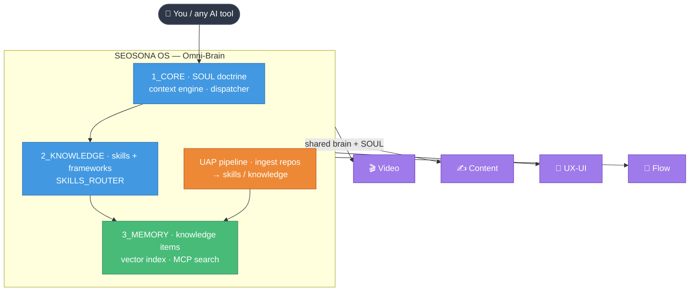

<div align="center">


<h1>SEOSONA OS</h1>

**The Omni-Brain — a self-improving AI operating system that governs your tools, your projects, and its own knowledge.**

[](https://opensource.org/licenses/MIT)
[](https://github.com/LongLeo287/SEOSONA-OS)
[](https://www.python.org/)
[](https://nodejs.org/)
[](https://modelcontextprotocol.io/)

*One brain. Every AI tool. Every project. Knowledge that grows itself.*

*Đọc bằng Tiếng Việt: **[docs/README-vi.md](docs/README-vi.md)***

</div>

---

## 📑 Table of Contents

- [What is SEOSONA OS?](#-what-is-seosona-os)
- [Why it exists](#-why-it-exists)
- [Core capabilities](#-core-capabilities)
- [Architecture](#-architecture)
- [The ecosystem (satellites)](#-the-ecosystem-satellites)
- [Quick start](#-quick-start)
- [Repository structure](#-repository-structure)
- [How it works](#-how-it-works)
- [Documentation](#-documentation)
- [Design principles](#-design-principles)
- [License](#-license)

---

## 🧠 What is SEOSONA OS?

**SEOSONA OS is a personal AI operating system.** It is the central "Omni-Brain" that:

1. **Governs** every AI coding tool on your machine — one doctrine (`SOUL.md`) injected into Cursor,
   Claude Code, Codex, Windsurf, Aider and the rest, so they all share the same rules, memory and skills.
2. **Remembers** — a queryable knowledge base of 3,000+ analyzed knowledge items, exposed to any agent
   through a semantic-search MCP server and a code knowledge-graph.
3. **Grows itself** — the **UAP** pipeline ingests external repositories, analyzes them, and turns the
   genuinely useful ones into routable skills and knowledge, entirely on its own.
4. **Acts** — a routing + dispatch layer that selects the right skill for a task and can safely execute it,
   guarded against irreversible side effects.
5. **Commands an ecosystem** — four satellite projects (Video, Content, UX-UI, Flow) connect back to this
   brain and share its knowledge at runtime.

It is not a passive "second brain" you read from. It routes, decides, ingests, self-improves, and runs
autonomous background loops — a governing knowledge OS.

---

## 💡 Why it exists

Every AI tool starts from zero: it doesn't know your rules, your projects, or what you've already learned.
You re-paste the same system prompt, re-explain the same context, and lose every insight the moment the
session ends. SEOSONA OS fixes that at the operating-system level:

> **Set it up once. Every AI on your machine — and every project you own — inherits one shared brain that
> only gets smarter over time.**

---

## ⚙️ Core capabilities

| Capability | What it does |
|---|---|
| 🧬 **SOUL doctrine injection** | A single master intelligence layer (`1_CORE/SOUL.md`) is anchored to every detected AI tool via a portable `~/.seosona` junction — zero hardcoded paths. |
| 🔎 **Shared knowledge brain** | `seosona-knowledge` MCP does semantic (TF-IDF) search over `3_MEMORY/knowledge_items`; `codebase-memory` MCP serves a deterministic code knowledge-graph. |
| 🛰️ **UAP — self-ingestion** | The Universal Assimilation Pipeline clones → security-scans → analyzes → classifies → assimilates external repos into skills/knowledge, one repo at a time, with dedup + version checks. |
| 🗺️ **Skills router + dispatch** | 280+ skills are auto-indexed into `SKILLS_ROUTER.md`; the context engine selects the most relevant per task; the dispatcher can execute them behind a hard side-effect guard. |
| 🌐 **Capability bridge** | A validated registry that routes a task to the right skill/connector/persona and flags what is safe to auto-run. |
| 🧠 **Persistent memory** | File-based knowledge items, a semantic vector index (self-healing), and per-project memory namespaces. |
| 🤖 **Autonomous daemons** | Dreaming, evaluation, predictive-scan, self-upgrade and memory-compression loops run on boot / on demand. |
| 🔐 **Security-first** | English-only linter, SSRF-guarded connectors, a mass-delete integrity guard, and a hard denylist on auto-executed side effects (push/deploy/publish/credentials). |

---

## 🏛️ Architecture



The OS is organized into numbered domain tiers. **These paths are portable (`~/.seosona/1_CORE/…`) and
referenced throughout the codebase — they are the architecture, not folders to flatten.**

---

## 🛰️ The ecosystem (satellites)

SEOSONA OS is the MotherBrain for four connected projects. Each ships a `seosona.project.json` + a
`.mcp.json` that registers the shared knowledge brain, so a session inside any of them can query the
central knowledge base at runtime, and OS indexes their content back.

| Satellite | Domain |
|---|---|
| 🎬 **SEOSONA Video** | AI video production (VN ASR/TTS, HyperFrames render) |
| ✍️ **SEOSONA Content** | Content generation + SEO feeders |
| 🎨 **SEOSONA UX-UI** | Design intelligence + motion systems |
| 🔀 **SEOSONA Flow** | Workflow / explainer-video automation |

Connect a satellite from inside its repo:

```bash
npm run project:init
```

---

## 🚀 Quick start

A fresh clone is **complete and runnable** — all code, config, personas, the skill library, the knowledge
base, and 35 vendored agent skills ship in the repo. See **[SETUP.md](SETUP.md)** for the full guide.

```bash
git clone https://github.com/LongLeo287/SEOSONA-OS.git
cd SEOSONA-OS
npm install                 # runs postinstall (git hooks)

# Fetch the heavy code-nav binary (over GitHub's 100 MB/file limit):
powershell -File 1_CORE/bin/codebase-memory-mcp/install.ps1

# Open a NEW agent session — .mcp.json spawns the knowledge servers at start.
```

The semantic vector index is **not** shipped; it self-heals — the first knowledge query rebuilds it from
the KIs in ~12 s and persists it.

---

## 📂 Repository structure

```
SEOSONA-OS/
├── 1_CONFIG/       # Settings, API-gateway config, workspace + satellite registry
├── 1_CORE/         # The brain: SOUL.md, context engine, dispatcher, UAP pipeline,
│                   #   connectors, daemons, capability bridge, MCP servers, bin/
├── 2_KNOWLEDGE/    # The skill library: frameworks + SKILLS_ROUTER.md (auto-generated)
├── 3_MEMORY/       # The memory: knowledge_items (KIs), project namespaces, plans
├── 4_AGENTS/       # Agent personas
├── 5_RESEARCH/     # Vetted reference material from ingestion
├── .agents/skills/ # 35 vendored agent skills (heavy assets fetched on setup)
├── cli/            # Node.js CLI package
├── docs/           # Architecture wiki + audit records
├── .mcp.json       # Registers the codebase-memory + seosona-knowledge MCP servers
├── SETUP.md        # Clone-to-run guide
└── AGENTS.md · GEMINI.md   # Root agent-instruction conventions
```

**Not in git** (fetched or local): the 257 MB code-nav `.exe` (has `install.ps1`), heavy skill assets
(fonts, test cassettes), generated runtime state (`vector_index/`, queues, logs), and secrets
(`.env` — copy `.env.example`).

---

## 🔧 How it works

**The universal anchor.** A filesystem junction at `~/.seosona` points to wherever this repo lives, so
every tool reads the same brain regardless of where the folder sits. Move it, re-run setup, the anchor
updates — no hardcoded paths anywhere.

**The runtime loop.** A task enters → the **context engine** parses `SKILLS_ROUTER.md` and selects the
top-relevant skills → the **capability bridge** flags what is safe → the **dispatcher** returns guidance
or executes a runnable, refusing any script whose name signals an irreversible/outward side effect.

**Self-improvement.** UAP ingests a repo, the classifier tiers evidence (dep-file imports weigh far more
than filename keywords) to decide the real fit, and only genuine matches become skills/knowledge — the
rest stay as reference, queryable but not dumped into the system.

---

## 📚 Documentation

| Doc | Topic |
|---|---|
| [docs/00_master_architecture.md](docs/00_master_architecture.md) | Full system architecture |
| [docs/01_agents_roster.md](docs/01_agents_roster.md) | Agent personas |
| [docs/02_skills_frameworks.md](docs/02_skills_frameworks.md) | Skills + frameworks |
| [docs/03_uap_pipeline.md](docs/03_uap_pipeline.md) | The UAP self-ingestion pipeline |
| [docs/05_brain_and_memory.md](docs/05_brain_and_memory.md) | Knowledge + memory |
| [docs/06_sops_rules_workspaces.md](docs/06_sops_rules_workspaces.md) | SOPs, rules, workspaces |
| [SETUP.md](SETUP.md) | Clone-to-run setup |

---

## 🎯 Design principles

- **Portable, zero-hardcode** — everything anchors to `~/.seosona`.
- **Honest seams** — a capability that isn't built throws or degrades honestly; nothing fakes a result.
- **Analyze, don't dump** — ingestion classifies and routes; only genuine fits enter the system.
- **Safe autonomy** — auto-execution is gated by a hard side-effect denylist; mass deletions need an
  explicit override.
- **Frugal** — heavy binaries and generated state stay out of git; the repo is a clean, self-contained clone.

---

## 📄 License

[MIT](LICENSE) © SEOSONA

<div align="center">
<sub>Built as a self-improving Omni-Brain. One setup — every AI, every project, one growing mind.</sub>
</div>
