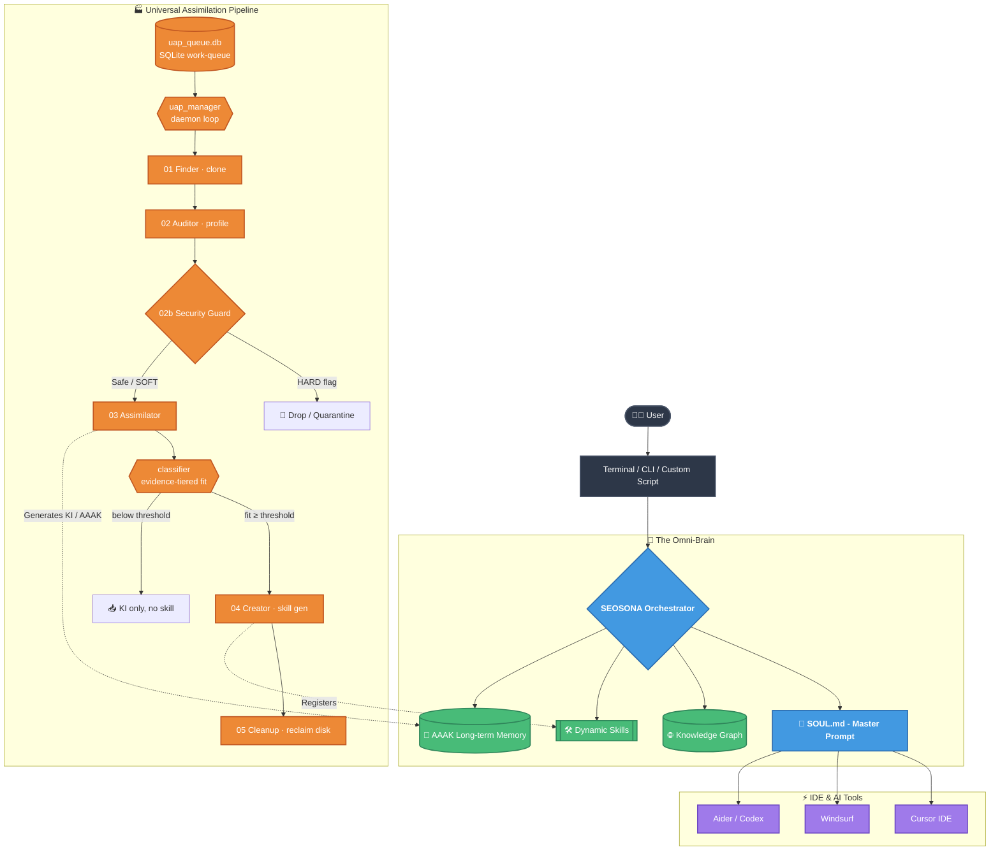

# SEOSONA OS: Master Architecture

SEOSONA OS is a Universal AI Operating System that injects a unified intelligence layer (`SOUL.md`) into your local environment, effectively giving every AI coding tool (Cursor, Windsurf, Codex, etc.) shared memory, skills, and context.

---

## 🏛️ The OmniClaw Architecture

The system is designed as a decentralized "Omni-Brain" that anchors to your machine and intercepts communications between you and your AI tools.

> [!NOTE]  
> The OmniClaw Architecture guarantees **Zero Hardcodes**. By using an OS-level symlink (`~/.seosona`), the core intelligence can be securely moved or relocated without breaking the Execution Layer.

---

## 🧩 System Modules & Technologies

SEOSONA OS is compartmentalized into 5 distinct operational zones, each governed by its own technology stack.

| Zone | Purpose | Core Technologies | Data Formats |
| :--- | :--- | :--- | :--- |
| **`1_CORE`** | The brain's processing center. Contains master prompts, the UAP daemon, and intent routing logic. | Python 3.11+, SQLite, AsyncIO | `.md`, `.py` |
| **`2_KNOWLEDGE`** | The active Skill Ecosystem. Contains generated frameworks, templates, and the Semantic Index. | LLM Routing, Regex Scanners | `SKILL.md`, `YAML` |
| **`3_MEMORY`** | Long-term retention. Stores the compressed architectural specs of all ingested repositories. | MemPalace Protocol | `.aaak`, `.db`, `.json` |
| **`4_AGENTS`** | Personnel Roster. Defines the cognitive boundaries of specialized AI Personas. | Prompt Engineering | `.md` |
| **`5_RESEARCH`** | The Sandbox. A temporary, isolated quarantine zone for cloning and auditing untrusted code. | Git, OSINT Scrapers | Raw Source Code |

---

## 🔒 Security Posture

> [!CAUTION]
> **Air-Gapped Analysis:** The `5_RESEARCH` zone is strictly isolated. Every cloned repo is scanned by `02b_security_guard.py` **before** assimilation. It raises a **HARD** flag on leaked secrets (AWS/Google/GitHub keys, private keys) and outright-destructive payloads → the repo is dropped and never processed; a **SOFT** flag on suspicious-but-common patterns (`curl … | sh`, prompt-injection strings) → warn and continue. Only clean/SOFT repos reach the Assimilator.

### The pipeline in reality

Work is driven by `uap_manager.py`, a daemon that pulls repos from a SQLite queue (`3_MEMORY/uap_queue.db`, statuses `PENDING → AUDITED → ASSIMILATED → CREATED → COMPLETED`, with `FAILED`/`BLOCKED` error terminals) — **not** from a spreadsheet. A HARD security block is a fast-path drop: the guard marks the repo `CREATED` so Cleanup reclaims its clone without ever assimilating it or generating a skill. Each surviving repo flows through numbered stages:

| Stage | Script | Does |
| :--- | :--- | :--- |
| 01 Finder | `01_finder.py` | Clones the queued repo into `5_RESEARCH`. |
| 02 Auditor | `02_auditor.py` | Profiles structure, language, and intent. |
| 02b Security Guard | `02b_security_guard.py` | HARD/SOFT threat scan (see above). |
| 03 Assimilator | `03_assimilator.py` | Compresses the repo into a Knowledge Item (KI/AAAK) in `3_MEMORY`. |
| — Classifier | `classifier.py` | Evidence-tiered fit score (strong signals weighted ~22× vs weak ~6×); only repos at/above the fit threshold graduate to a generated skill. |
| 04 Creator | `04_creator.py` | Generates a runnable skill + registers it. |
| 05 Cleanup | `05_cleanup.py` | Reclaims the `5_RESEARCH` clone to free disk. |

A crash mid-flight marks only the oldest in-flight repo `FAILED` (with a retry counter) so the queue never wedges.
