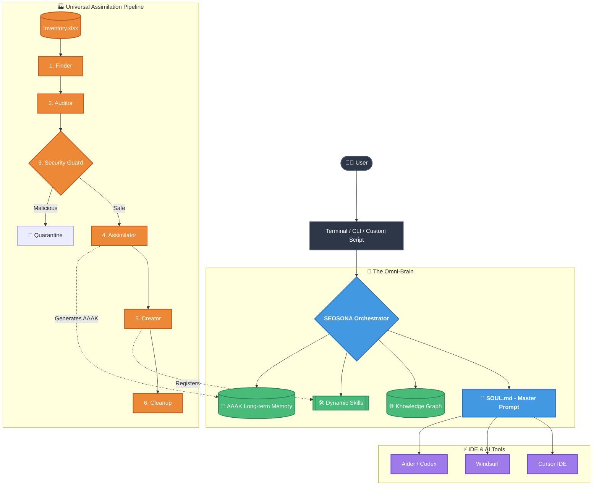

# SEOSONA OS: Master Architecture

SEOSONA OS is a Universal AI Operating System that injects a unified intelligence layer (`SOUL.md`) into your local environment, effectively giving every AI coding tool (Cursor, Windsurf, Codex, etc.) shared memory, skills, and context.

---

## 🏛️ The OmniClaw Architecture

The system is designed as a decentralized "Omni-Brain" that anchors to your machine and intercepts communications between you and your AI tools.

> [!NOTE]  
> The OmniClaw Architecture guarantees **Zero Hardcodes**. By using an OS-level symlink (`~/.seosona`), the core intelligence can be securely moved or relocated without breaking the Execution Layer.

---

## 🧩 System Modules & Technologies

SEOSONA OS is compartmentalized into 5 distinct operational zones, each governed by its own technology stack.

| Zone | Purpose | Core Technologies | Data Formats |
| :--- | :--- | :--- | :--- |
| **`1_CORE`** | The brain's processing center. Contains master prompts, the UAP daemon, and intent routing logic. | Python 3.11+, SQLite, AsyncIO | `.md`, `.py` |
| **`2_KNOWLEDGE`** | The active Skill Ecosystem. Contains generated frameworks, templates, and the Semantic Index. | LLM Routing, Regex Scanners | `SKILL.md`, `YAML` |
| **`3_MEMORY`** | Long-term retention. Stores the compressed architectural specs of all ingested repositories. | MemPalace Protocol | `.aaak`, `.db`, `.json` |
| **`4_AGENTS`** | Personnel Roster. Defines the cognitive boundaries of specialized AI Personas. | Prompt Engineering | `.md` |
| **`5_RESEARCH`** | The Sandbox. A temporary, isolated quarantine zone for cloning and auditing untrusted code. | Git, OSINT Scrapers | Raw Source Code |

---

## 🔒 Security Posture

> [!CAUTION]
> **Air-Gapped Analysis:** The `5_RESEARCH` zone is strictly isolated. All downloaded code is scanned by `02b_security_guard.py` for destructive commands (e.g., `rm -rf /`) and reverse shells **before** any AI is allowed to process the context. Malicious repos are instantly dropped.
