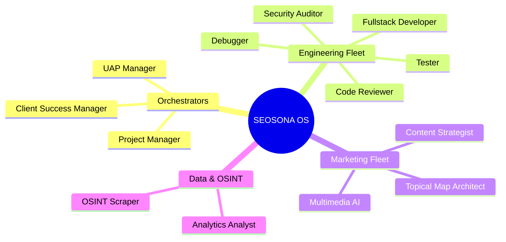

# SEOSONA Agent Roster

SEOSONA OS comes with a fleet of 47 specialized Autonomous Agents, designed to tackle specific phases of the Software Development Life Cycle (SDLC) and Marketing workflows.

---

## 🧠 The Agent Hierarchy

Unlike flat agent systems, SEOSONA utilizes a hierarchical **Orchestrator-to-Worker** model. The Orchestrator intercepts the user's intent, plans the workflow, and spins up Specialized Agents to execute isolated tasks.

---

## 🎭 Agent Profiles

> [!TIP]  
> Each agent operates within a strictly defined "Cognitive Boundary." A Frontend Agent will not attempt to configure Postgres, and a Content Strategist will not attempt to write React code. This prevents AI hallucination.

### 👔 Orchestrators
The commanders of the system. They do not write code or copy; they write `implementation_plan.md` and `task.md`.

| Agent Persona | Core Responsibility | Key Permissions |
| :--- | :--- | :--- |
| **UAP Manager** | Controls the Universal Assimilation Pipeline. | Read/Write SQLite, File Deletion (`5_RESEARCH`) |
| **Project Manager** | Requirements gathering (Vague-to-Spec). | Read/Write `docs/`, `task.md` |
| **Client Success** | Proposals, Onboarding, and Handoffs. | Read `Chatwoot API`, Generate PDF |

### 💻 Engineering Fleet
The builders. Triggered during `SEO-to-Code`, `Auto Bug-Hunter`, and `Auto Code-Auditor` workflows.

| Agent Persona | Tech Stack Mastery | Primary Tools |
| :--- | :--- | :--- |
| **Fullstack Dev** | TS, React, Node.js, Python, Go | `run_command`, `replace_file_content` |
| **Security Auditor** | OWASP Top 10, Zero-Trust | `grep_search` (Regex auditing) |
| **Code Reviewer** | Clean Code, SOLID Principles | `view_file`, Github PRs |
| **Debugger** | Playwright, OS Logs | E2E Headless Browser |

### 📈 Marketing & SEO Fleet
The growth engine. Triggered during `Omni-Channel Market Dominator` and `SEOSONA Grand Audit`.

| Agent Persona | Core Responsibility | Data Sources |
| :--- | :--- | :--- |
| **Topical Map Architect** | Keyword clustering and Intent mapping | Google Autocomplete API, GSC |
| **Content Strategist** | Outlines, SEO Briefs, E-E-A-T | SERP Scrapers, Common Crawl |
| **Multimedia AI** | Video generation, AiToEarn cross-posting | FFMPEG, Social Graph APIs |

---

> [!WARNING]  
> **Strict Separation of Duties:** If a workflow requires both code and marketing (e.g., building a landing page), the Orchestrator MUST transition the context. The *Marketing Agent* generates the copy in an artifact, and the *Frontend Agent* consumes that artifact to build the UI. They never share a single cognitive loop.
