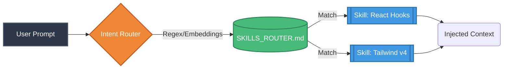

# SEOSONA Skills & Frameworks

A "Skill" in SEOSONA OS is a modular, autonomous unit of knowledge or a specialized script that can be hot-loaded into any Agent's context.

---

## 🎯 The Intent Router (Dynamic Context)

To prevent the LLM context window from overflowing, SEOSONA OS does not load all skills at once. Instead, it uses a Semantic **Intent Router** to dynamically fetch only the exact skills needed for the current prompt.

> [!TIP]  
> **Efficiency:** By dynamically routing skills, an agent tasked with CSS styling will never have its context window polluted by Python backend logic.

---

## 🧬 The Factual Generation Process

Through the Universal Assimilation Pipeline (UAP), SEOSONA automatically generates new skills by reading the **actual source code** of repositories, bypassing hallucination-prone READMEs.

1. **Knowledge Items (KI):** Fact-based Markdown files detailing the Tech Stack, Dependencies, and Public APIs of a library.
2. **AAAK Closets:** Deeply compressed MemPalace memory versions of KIs.
3. **Skill Templates:** When a repository already complies with SEOSONA's Skill architecture (`SKILL.md`), it is instantly absorbed as a native skill.

---

## 📚 Category Breakdown

The active registry organizes ~1,000 curated skills into SEOSONA's operational domains (the
library was de-bloated in 2026-06 — off-domain bulk ingestion like generic UI/web-dev, science,
and video was removed; only SEO/agent/content/automation skills are kept):

| Domain | Description | Example Nodes |
| :--- | :--- | :--- |
| **SEO & Marketing** | SERP/analytics parsers, audits, copywriting, distribution. | `seo_marketing`, `external_ecosystem`, `seo_audit_v3`, `outbound_marketing_cbo` |
| **Agent Workflows** | Orchestration, routing, harness patterns, capability bridge. | `agentic_workflows`, `agentic_orchestration`, `deerflow-harness-patterns` |
| **Scraping & Research** | Crawlers, browser automation, OSINT, knowledge retrieval. | `crawlee`, `firecrawl`, `browser-automation`, `osint`, `decodo-openclaw` |
| **LLM & Infra** | Local LLM runtime, code intelligence, data, security. | `ollama-runtime`, `local-llm-gemma`, `codebase-memory-mcp`, `polars-data`, `codeql-security` |
| **Content & Productivity** | Writing/humanizing, documents, productivity skills. | `humanizer`, `avoid-ai-writing`, `wewrite`, `productivity`, `kami` |

> [!WARNING]  
> **Never modify Auto-Generated Skills manually.** Any manual edits to `.agents/skills/` or
> `2_KNOWLEDGE/frameworks/` without regenerating `SKILLS_ROUTER.md` will break the semantic index.
> After changing skills, regenerate the router with `python 1_CORE/scripts/core/plugin_manager.py`,
> then verify with `node 1_CORE/scripts/seosona_capability_bridge.js validate`.
