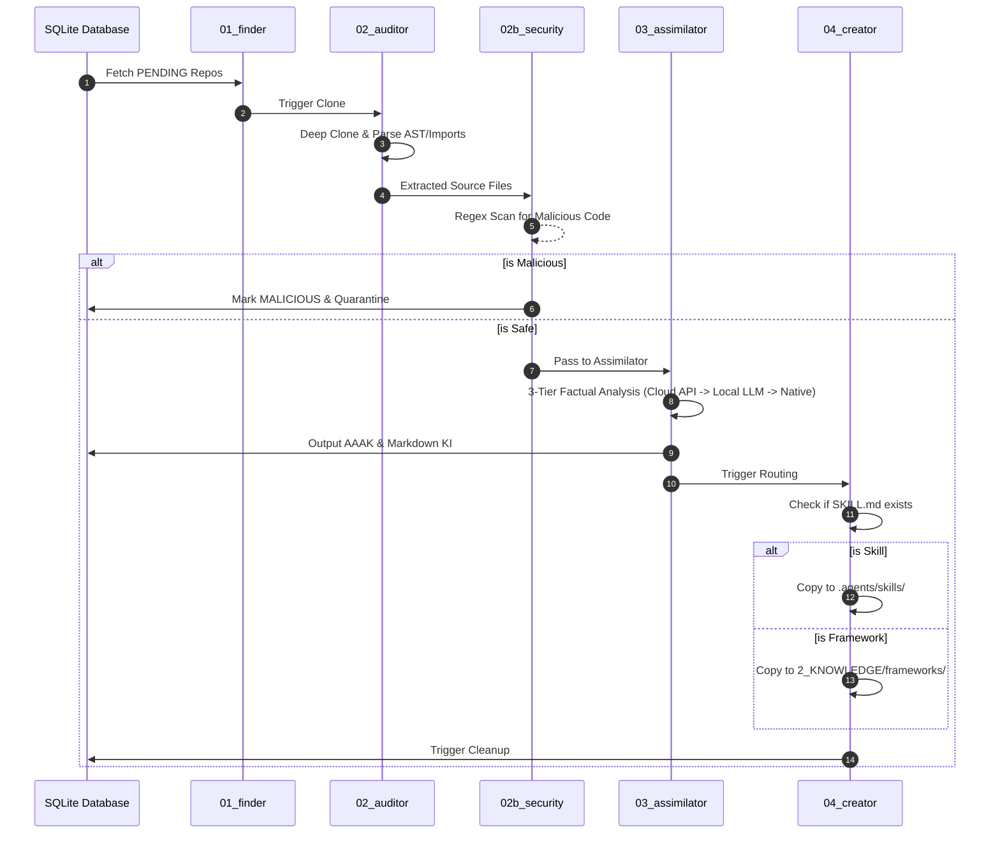

# SEOSONA Factual UAP Pipeline (Universal Assimilation Pipeline)

The SEOSONA Universal Assimilation Pipeline (UAP) is a massively parallel, fully automated system designed to ingest, audit, and convert raw repositories into high-density **Knowledge Items (AAAK)** and **Dynamic Skills** for the SEOSONA Omni-Brain.

---

## 🔬 The "Factual Source-Code" Paradigm

In previous versions, UAP relied on scanning `README.md` files. This led to "hallucinations" where LLMs would assume capabilities based on marketing text rather than actual code. 

**The new Factual UAP Pipeline completely ignores READMEs.** It strictly clones repositories and parses the *actual source code* (Entry points, configs, core modules) to guarantee 100% factual, evidence-backed knowledge ingestion.

---

## 🏗️ 5-Phase Architecture Sequence



### The 3-Tier Fallback Architecture (Phase 3)
If the primary LLM API fails (e.g., Rate Limits), the Assimilator never stops. It falls back gracefully:
1. **Tier 1 (Cloud APIs):** Google Gemini / OpenAI.
2. **Tier 2 (Local LLM):** Ollama running `qwen2.5-coder:7b` (Offline).
3. **Tier 3 (Code-Based):** Native Regex extraction of public exports and dependencies.

---

## 💾 AAAK Mockup (Output Example)

When the pipeline finishes, it generates an `.aaak` (Autonomous Atomic Asset Knowledge) file. This is a deeply compressed memory block designed for Agent context windows:

```yaml
# 3_MEMORY/knowledge_items/uap_facebook_react.aaak
---
id: uap_facebook_react
type: framework
version: 18.2.0
stack: [javascript, flow, cpp]
---
<memory_block>
[FACTUAL_EXPORTS]: useState, useEffect, useContext, useReducer, useCallback, useMemo, useRef, useImperativeHandle, useLayoutEffect, useDebugValue, useDeferredValue, useTransition, useId, startTransition
[DEPENDENCIES]: loose-envify, object-assign
[ARCHITECTURE]: Fiber reconciler, Concurrent mode (Lanes), Synthetic Events
[SECURITY_FLAGS]: CLEAN
</memory_block>
```

> [!NOTE]  
> The Pipeline completely wipes the cloned source code from the `5_RESEARCH` directory immediately after generating the AAAK file, ensuring **Zero Host Machine Bloat**.
