# SEOSONA V5 Intelligence Architecture (SEO & Marketing)

While SEOSONA OS primarily functions as a Universal AI Operating System for Senior Developers, it also features a massive standalone Python orchestrator designed specifically for **Deep SEO, Marketing, and OSINT Analysis**.

This V5 Engine replaces expensive SEO SaaS platforms by chaining free APIs, web scrapers, Playwright E2E testing, and AI-driven insights into a unified Premium Dashboard.

---

## 🌊 Parallel Execution Waves (Kahn's Topological Sort)

To maximize speed, the orchestrator does not run modules sequentially. It calculates dependencies and runs them in parallel waves.

```mermaid
gantt
    title V5 Audit Execution Waves
    dateFormat  s
    axisFormat  %S
    
    section Wave 1 (Data Fetch)
    PageSpeed Insights (CWV)    :a1, 0, 5s
    Technical SEO Spider        :a2, 0, 10s
    GSC Rankings Pull           :a3, 0, 3s
    Backlinks & Authority       :a4, 0, 6s

    section Wave 2 (Analysis)
    Keywords Intent Mapper      :after a3, 4s
    E-E-A-T Analyzer            :after a2, 7s
    Schema Validator            :after a2, 2s

    section Wave 3 (Synthesis)
    SERP Competitor Scraper     :after a1, 8s
    Playwright E2E QA           :after a2, 10s
    Premium HTML Dashboard      :after a2, 2s
```

---

## 📊 Premium Dashboard v4 (Mockup Preview)

When the audit is complete, the engine outputs a standalone `audit_report.html`. Here is a structural visualization of the final report interface:

  <!-- Header -->
  

    <h2 style="margin: 0; color: #fff; font-size: 20px;">🚀 SEOSONA Grand Audit: example.com</h2>
    

      OVERALL HEALTH: 82/100 (B+)
    

  

  <!-- Tabs -->
  

    
Technical SEO

    
Performance (CWV)

    
Content & E-E-A-T

    
Backlink Authority

  

  <!-- Content -->
  

    <h3 style="margin-top: 0; color: #fff;">Crawl Anomalies & Redirect Chains</h3>
    <table style="width: 100%; border-collapse: collapse; text-align: left; font-size: 14px;">
      <thead>
        <tr style="background: #2d3748; color: #a0aec0;">
          <th style="padding: 10px; border-bottom: 1px solid #4a5568;">URL Path</th>
          <th style="padding: 10px; border-bottom: 1px solid #4a5568;">Status</th>
          <th style="padding: 10px; border-bottom: 1px solid #4a5568;">Issue Detected</th>
          <th style="padding: 10px; border-bottom: 1px solid #4a5568;">AI Recommendation</th>
        </tr>
      </thead>
      <tbody>
        <tr style="background: rgba(229, 62, 62, 0.1);">
          <td style="padding: 10px; border-bottom: 1px solid #4a5568; color: #fc8181;">/blog/old-post</td>
          <td style="padding: 10px; border-bottom: 1px solid #4a5568;"><code>301 -> 404</code></td>
          <td style="padding: 10px; border-bottom: 1px solid #4a5568; font-weight: bold; color: #fc8181;">🔴 Redirect Loop</td>
          <td style="padding: 10px; border-bottom: 1px solid #4a5568;">Fix canonical and redirect directly to /blog/new-post.</td>
        </tr>
        <tr style="background: rgba(221, 107, 32, 0.1);">
          <td style="padding: 10px; border-bottom: 1px solid #4a5568; color: #fbd38d;">/services</td>
          <td style="padding: 10px; border-bottom: 1px solid #4a5568;"><code>200 OK</code></td>
          <td style="padding: 10px; border-bottom: 1px solid #4a5568; font-weight: bold; color: #fbd38d;">🟠 Missing H1 Tag</td>
          <td style="padding: 10px; border-bottom: 1px solid #4a5568;">Inject primary target keyword into an H1 tag above the fold.</td>
        </tr>
        <tr>
          <td style="padding: 10px; border-bottom: 1px solid #4a5568; color: #9ae6b4;">/about-us</td>
          <td style="padding: 10px; border-bottom: 1px solid #4a5568;"><code>200 OK</code></td>
          <td style="padding: 10px; border-bottom: 1px solid #4a5568; color: #68d391;">🟢 Clean</td>
          <td style="padding: 10px; border-bottom: 1px solid #4a5568;">No action required.</td>
        </tr>
      </tbody>
    </table>
  

---

## 🛠️ The 14 Integrated Modules

The orchestration pipeline runs the following modules simultaneously wrapped in strict fix loops:

1. **PageSpeed Insights (CWV)**: Extracts Lab & Real-user Core Web Vitals directly from Google's API.
2. **Keywords Intent Mapper**: Generates topical maps based on Google autocomplete intent vectors.
3. **SERP Competitor Scraper**: Bypasses bot protections to scrape H1/Title tags and identify content gaps.
4. **Backlinks & Authority**: Extracts domain authority via Open PageRank and Common Crawl data.
5. **GSC Rankings Pull**: Direct OAuth pull from Google Search Console to track exact click/impression metrics.
6. **Rank Tracker**: Specialized quick-win tracking for keywords hovering in Positions 4-20.
7. **GA4 Analytics**: Aggregates sessions, bounce rates, and user behavior flows.
8. **Technical SEO Spider**: Deeply crawls `robots.txt`, XML sitemaps, canonicals, and redirect chains.
9. **Schema Validator**: Checks JSON-LD and Microdata structures for Rich Snippet eligibility.
10. **E-E-A-T Analyzer**: Identifies thin content, missing author biographies, and orphan pages.
11. **Log Analyzer**: Parses Nginx/Apache server logs to identify Googlebot crawl patterns.
12. **OSINT Entity Scan**: Deep web investigation for Author/Brand validation across social footprints.
13. **Playwright E2E QA**: Automated UX/CRO friction detection via headless Chromium.
14. **Premium HTML Dashboard**: Renders the final output into a self-contained, interactive HTML file.
