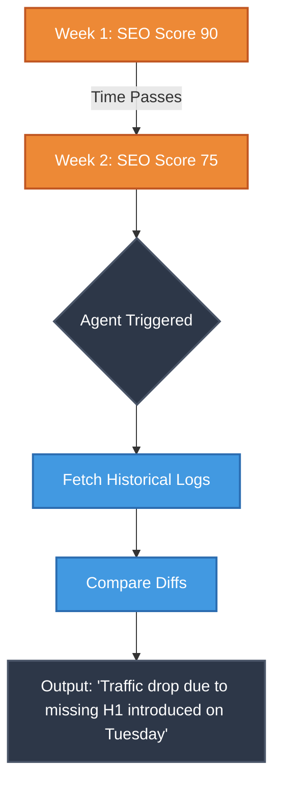

# SEOSONA Omni-Brain & Memory Architecture

The defining feature of SEOSONA OS is its unified memory system, known as the **Omni-Brain**. Rather than allowing IDEs and CLIs to operate in isolated, amnesiac states, the Omni-Brain ensures that every AI tool on your machine shares the exact same persistent context, memory, and rules.

---

## 🏛️ The Memory Palace (Folder Structure)

All memory is stored locally, unencrypted (for speed), and structured semantically.

```text
3_MEMORY/
├── 📂 knowledge_items/         # The active memory blocks
│   ├── 📄 uap_react.aaak       # Deeply compressed Agent memory (Binary/YAML)
│   ├── 📄 uap_react.md         # Human-readable factual summary
│   └── 📄 uap_express.aaak     
├── 📂 audit_reports/           # Historical snapshots of UAP extractions
│   └── 📄 audit_react.json     
├── 📂 logs/                    # Chronological execution traces
│   └── 📄 daemon_2026.log      
└── 🗄️ uap_queue.db             # SQLite Queue state (PENDING, AUDITED...)
```

---

## 🧠 The SOUL.md (Master Intelligence)

At the absolute core of the Omni-Brain lies `1_CORE/SOUL.md`. 
This is a massive (~10,000 character) system prompt that serves as the "DNA" of SEOSONA. 

> [!IMPORTANT]  
> **The Prime Directive:** *"Always learning, upgrading, optimizing, automating, developing, improving... from new data, new information, new knowledge. Learn from mistakes to be better."*

**Injection Mechanism:**
`SOUL.md` is dynamically injected into `.cursorrules`, `.windsurfrules`, `.clinerules`, and CLI environment variables (`ANTIGRAVITY_SYSTEM_PROMPT`).

---

## ⏳ Time-Decay Learning (Chronological Memory)

Unlike typical AI that only knows the "current state", SEOSONA tracks historical events using logs and `audit_reports/`. This allows Agents to analyze regressions over time.



---

## 🗜️ AAAK Closets (Autonomous Atomic Asset Knowledge)

- **Concept:** AAAK files are hyper-compressed, deeply structured context blobs.
- **Creation:** When the UAP Pipeline scans a repository, the Assimilator converts the factual source code into an `.aaak` file.
- **Usage:** Agents can hot-load specific AAAK files when they need deep technical context on a specific framework or tool, preventing the context window from being flooded with irrelevant data.

> [!TIP]  
> If an agent needs to write a React component, it doesn't need to know about the entire backend structure. It dynamically hot-loads `uap_react.aaak` and reads only the exact component signatures needed for the task.
