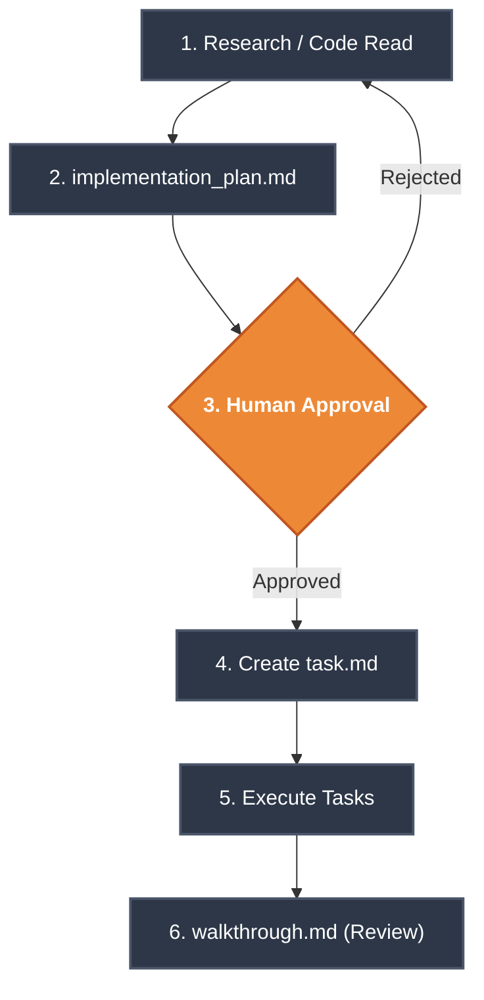

# SOPs, Rules & Workspaces

For an Autonomous Agent Fleet to operate safely across a user's entire machine without causing catastrophic damage, strict boundaries must be established. SEOSONA OS enforces these boundaries through **Standard Operating Procedures (SOPs)** and the **Omni-Brain Protocol**.

---

## 🛑 The Omni-Brain Protocol (Zero-Tolerance Rules)

The Omni-Brain Protocol is injected directly into `SOUL.md`. Violation of these rules triggers automatic failure loops.

> [!CAUTION]
> **[RULE 01] Strict Tool Specificity**
> Always prioritize using the most specific tool you can for the task at hand. 
> - NEVER run `cat` inside a bash command to create a new file. 
> - ALWAYS use `grep_search` instead of running `grep` inside a bash command.
> - DO NOT use `ls` for listing, `cat` for viewing, `grep` for finding, or `sed` for replacing.

> [!CAUTION]
> **[RULE 02] English-Only Cognitive Policy**
> All internal system files, code variables, logging, and structural documents MUST be written in English. 
> *(The `language_linter.js` validates this continuously before any Git commit).*

> [!CAUTION]
> **[RULE 03] Factual Source-Code Principle**
> Do not generate knowledge or code based on `README.md` assumptions. You must inspect the factual source code (AST, `package.json`, public exports) before drafting implementation plans.

---

## 📋 Standard Operating Procedures (SOPs)

SOPs are modular, step-by-step instructional documents located in `2_KNOWLEDGE/sops/`. They guide agents on exactly how to execute repetitive tasks reliably.

### The "Planning Mode" SOP
Whenever an Agent receives a complex task, it is strictly forbidden from editing code immediately. It must follow this flowchart:



---

## 📁 Workspaces & Project Connectors

SEOSONA OS is capable of managing multiple isolated "Workspaces" simultaneously. 

### The `seosona.project.json` Manifest
When a user runs `seosona init` inside a specific project repository, the OS generates a manifest file binding that local directory to the global OS.

```json
{
  "project_id": "seosona-os-core",
  "memory_namespace": "seosona-os",
  "autonomy_level": "project_edit",
  "rules": [
    "~/.seosona/1_CORE/SOUL.md",
    "AGENTS.md"
  ]
}
```

> [!WARNING]
> **Git Sandboxing & Refactoring**
> Agents are required to create new feature branches before making massive refactors. Direct pushes to `main` are restricted unless explicitly permitted by the human Orchestrator. The autonomy level (`project_edit` vs `read_only`) strictly enforces file modification capabilities.
